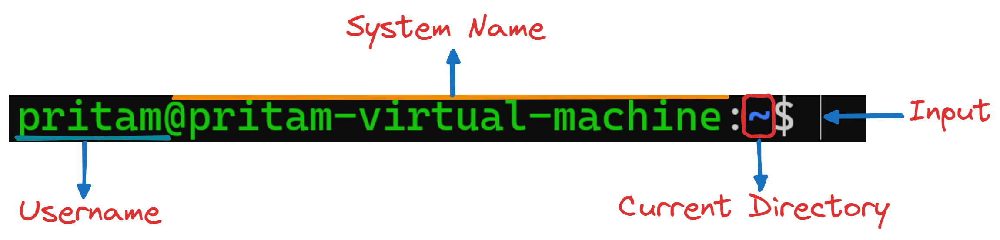
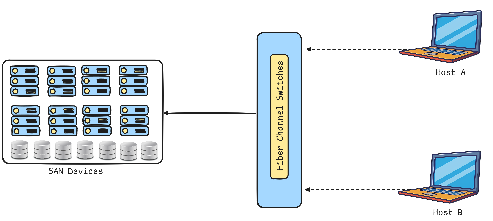

# 💻Linux Theoretical Concepts💻
<div align="center">
  
</div>

Welcome! to **Linux Theoretical Concepts** guide. This is your go-to guide for mastering Linux concepts and theory. Whether you're a beginner or need a quick reference it offers essential insights to enhance your Linux understanding and usage.

# Table of Contents

- [**What is Linux?**](#what-is-linux)
- [**Who is Linux?**](#who-is-linux)
- [**Where is Linux?**](#where-is-linux)
- [**Why is Linux**?](#why-is-linux)
- [**Common Challenges**](#common-challenges)
- [**Linux Desktop vs Linux Server**](#linux-desktop-vs-server)
- [**Working with Shell - I**](#working-with-shell---i)
  - [Home Directory](#home-directory)
  - [Commands & Arguments](#commands--arguments)
  - [Commands Type](#commands-type)
  - [Linux Basic Command](#linux-basic-commands)
  - [Absoluiute & Relative Path](#absoluiute--relative-path)
  - [Pushd and Popd](#pushd-and-popd)
  - [Shell Types](#shell-types)
  - [Bash Environment Variables](#bash-environment-variables)
  - [PATH Variables](#path-variables)
  - [Bash Prompt](#bash-prompt)
  - [Linux Prompt](#linux-prompt)
- [**Core Concepts**](#core-concepts)
  - [Linux Kernel](#linux-kernel)
  - [Linux Boot Sequence](#linux-boot-sequence)
  - [Systemd Targets](#systemd-targets)
  - [File System Hierarchy in Linux](#file-system-hierarchy-in-linux)
  - [Linux Distributions](#linux-distributions)
- [**Package Management**](#package-management)
  - [Software Package](#software-package)
  - [Package Manager](#package-manager)
  - [Upgrade vs Update](#upgrade-vs-update)
  - [APT vs APT-GET](#apt-vs-apt-get)
- [**Working with Shell - II**](#working-with-shell---ii)
  - [Vim Editor](#vim-editor)
- [**Linux Networking Basics**](#linux-networking-basics)
  - [Name Resolution](#name-resolution)
  - [DNS (Domain Name System)](#dns-domain-name-system)
  - [Domain Name](#domain-name)
  - [Hub](#hub)
  - [Switching](#switching)
  - [Routing](#routing)
  - [Gateway](#gateway)
- [**Linux Security & File Permissions**](#linux-security--file-permissions)
  - [Linux Security](#linux-security)
  - [Access Controls Files](#access-controls-files)
  - [File Permissions](#file-permissions)
  - [SSH (Secure Shell)](#ssh-secure-shell)
  - [SCP (Secure Copy Protocol)](#scp-secure-copy-protocol)
  - [IP Tables](#ip-tables)
  - [CRON](#cron)
- [**SystemD**](#systemd)
  - [Key Features of systemd](#key-features-of-systemd)
  - [Real-Life Example of systemd in Action](#real-life-example-of-systemd-in-action)
- [**Storage in Linux**](#storage-in-linux)
  - [File System in Linux](#file-system-in-linux)
  - [Disk Partition](#disk-partition)
  - [NFS (Network File System)](#nfs-network-file-system)
  - [Storage Devices](#storage-devices)
  - [LVM (Logical Volume Manager)](#lvm-logical-volume-manager)
# What is Linux?
Linux is an **open-source operating system** based on **Unix**, widely used for *servers*, *desktops*, and *embedded systems*. 
It provides a stable, secure, and flexible environment for managing hardware resources and running applications.

# Who is Linux?
Linux was created by **Linus Torvalds** in **1991**. It started as a personal project and has grown into a major force in computing, supported by a global community of developers.

# Where is Linux?
**World Wide Web :**
- 96
3% of the top 1 milions world’s web-servers running on Linux.
**Research/High-Performance Compute :**
- Google, Amazon, NSA, 100% of TOP500  Super-computers.
**Modern Smartphones and devices :**
- The Android phone (86% of all smartphones are powered by Linux)
- Amazon Kindle
- Smart TVs/Devices

# Why is Linux?
- Free and open-source.
- Powerful for research datacenters
- Personal for desktops and phones
- Universal
- Community (and business) driven.

# Common Challenges
- **Directory Navigation :** Difficulty navigating directory structures and files.
- **Text Editors :** Lack of experience with text editors, especially Vi or Vim.
- **Linux Variants :** Confusion over different flavors of Linux.
- **Installation Errors :** Issues during application and dependency installation.
- **Package Managers :** Unfamiliarity with rpm, dpkg, apt, and yum.
- **Networking Issues :** Problems with networking between VMs.
- **Permissions :** Challenges with permissions and security settings.
- **Hands-On Practice :** Insufficient practical experience.


# Linux Desktop vs Server
1. **Purpose**
    - **Desktop :** For personal use like web browsing, media & office tasks. It includes a **GUI (Graphical User Interface)**.
    - **Server :** Runs backend tasks like **web hosting**, **databases**, etc. often without a GUI to save resources using a **CLI(Command Line Interface)** for management.
2. **Resource Usage**
    - **Desktop :** Uses more **RAM/CPU** for the **GUI** and **applications**.
    - **Server :** Optimized for performance prioritizes services over graphical environments.
3. **Security**
    - **Desktop :** Basic security with a smaller attack surface.
    - **Server :** Enhanced security for exposed services like **firewalls**, **SSH hardening** etc.
4. **Software** 
    - **Desktop :** Productivity-focused apps like **browsers** or **office suites**.
    - **Server :** Server-focused software like **web servers** or **databases**.
5. **Updates**
    - **Desktop :** Regular updates with reboots often required.
    - **Server :** Minimized downtime with automated maintenance, focusing on stability & security patches.

# Working with Shell - I
A shell is a **command-line interface** that allows users to interact with the operating system by typing commands to perform tasks.
Using a **shell** instead of a **Graphical User Interface** (GUI) allows for greater efficiency, automation through scripting, and more precise control over system tasks especially for advanced users and server management.
## Home Directory
The home directory is a unique, user-specific folder (e.g., `/home/username`) where personal files, settings, and configurations are stored in a Linux system.

<div align="center">
  
</div>

## Commands & Arguments 
In Linux, **`commands`** are instructions given to the shell to perform specific tasks and **`arguments`** are additional pieces of information passed to those commands to modify their behavior or specify what they operate on.
- **Structure :**
    - **Command :** The main instruction (e.g., **`ls, cp, mkdir`**).
    - **Argumants :** Options or parameters that provide context or modify the command's behavior (e.g., **`-l`*for long format).
- **Example :**
<div align="center">
    
</div>

   Here **`/home/user`** an argument that specifying the directory to list.
- **Options :** Usually start with **`-`** or **`--`**(e.g., **`-a`**, **`--all`**).

## Commands Type 
In Linux, commands can be categorized into 2 types based on their location on the system.
- **External Commands :** In Linux, **external commands** refer to commands that are not built into the shell itself but are separate executable programs stored in the file system. These commands are usually located in directories such as **`/bin`**, **`/usr/bin`**, **`/sbin`**, and **`/usr/sbin`**, and they are run by the shell when called from the terminal. **Example :** **`ls`**, **`cp`**, **`grep`**

- **Internal Commands :** These are built into the shell itself and do not require external programs to run.  **Example :** **`cd`**, **`echo`**, **`pwd`**

## Linux Basic Commands

For more details on commands see the [Linux Commands](https://github.com/PritamChakrabortyShuvo/Linux/blob/main/Linux-Commands.md) file.

## Absoluiute & Relative Path

A **path** is the location of a file or directory in the filesystem which can be either **absolute** (full path) or **relative** (relative to the current directory).
- **Absolute Path :** An absolute path is the full path to a file or directory from the root directory **`/`**.Starting from the top of the filesystem. For example: **`/home/user/directory/file.txt`**.

- **Relative Path :** A relative path is the path to a file or directory from our current working directory, without starting from the root. For example, if we are in **`/home/user`** the relative path to **`file.txt`** inside directory would be **`directory/file.txt`**.

<div align="center">
    
</div>

## Pushd and Popd
**`pushd`** & **`popd`** are commands in Bash used for managing the directory stack allowing us to easily switch between directories.

- **`pushd` :** This command saves the current directory on a stack and then changes to the specified directory. For example, running **`pushd`** **`/path/to/directory`** will add the current directory to the stack and navigate to **`/path/to/directory`**.

- **`popd` :** This command removes the top directory from the stack and changes to that directory. For instance, running **`popd`** after a **`pushd`** will take you back to the directory that was saved on the stack.

These commands are useful for quickly navigating between multiple directories without needing to remember or retype paths.
## Shell Types
There are various shell types in linux. They are 
- **Bourne Shell (`sh`) :** The original Unix shell, known for its simplicity and scripting capabilities, widely used for system scripts.
- **C Shell (`csh/tcsh`) :** A shell with C-like syntax, offering features like aliases and job control, with **`tcsh`** as an enhanced version.
- **Korn Shell (`ksh`) :** A superset of the Bourne shell, adding features like command-line editing and improved scripting.
- **Z Shell (`zsh`) :** A highly customizable shell with advanced features like auto-completion, globbing, and theming.
- **Bourne Again Shell (`bash`) :** A popular, feature-rich shell, backward-compatible with **`sh`**, and widely used as the **default shell in Linux systems**.

**`bash`** shell has some features like
- Bash Auto Completion
- Alias
- Command History

## Bash Environment Variables
Bash environment variables are like placeholders that store important information such as **user settings** or **system paths**. They help the shell and programs run smoothly and can be used to control how commands work. For example :

<div align="center">
    
</div>

Logname show the name which stored in the logname.

We can also set an environment variable. For example :

<div align="center">
    
</div>

## PATH Variables
The **PATH** variable in Bash is a list of directories where the shell searches for executable programs when we enter a command. If a command is in one of these directories we can run it without needing to type the full path.

## Bash Prompt
The **bash prompt** is the text displayed in the terminal where we type commands. It typically shows our username, hostname, and current director & can be customized using environment variables like **`$PS1`**.

<div align="center">
    
</div>

## Linux Prompt

**The Linux prompt**, also known as the **command prompt**, is the interface in a terminal where users type commands. It typically looks like this :

<div align="center">
    
</div>

**Components of the Linux Prompt**

- **`username:`** The current user's name.

- **`hostname:`** The name of the computer.

- **`current-directory:`** The directory the user is currently in.

- **`$ or #:`** The symbol at the end of the prompt. **`$`** **indicates a regular user**, while **`#`** **indicates the root (superuser)**.

The prompt waits for the user to enter commands, which are then executed by the shell.


# Core Concepts
Linux core concepts include the system's main parts, like the kernel, file system, processes, and user management, which work together to run applications smoothly and securely.

## Linux Kernel
The **kernel** is the core part of the Linux operating system that manages hardware resources, facilitates communication between software and hardware & handles system processes, memory, and file management. 
It acts as a bridge between applications and the underlying hardware.

<div align="center">
    
</div>

**Kernel functions** are the core tasks performed by the Linux kernel to manage system resources and ensure smooth operation. Here’s a brief overview of the main kernel functions

- **Device Management :** Handles device drivers, input/output operations, and peripheral devices.

- **Resource Management :** Manages CPU processes and bridges resources with processes.

- **Memory Management :** Allocates and manages system memory efficiently.

- **System Calls :** Handles requests for file operations, memory control, and process management.

- **Performance Optimization :** Balances resources, schedules tasks, and enhances system efficiency.

Linux's compatibility with different hardware configurations ensures versatile usage across a wide range of devices.

- **Types of Kernels in OS Architecture :** Monolithic; Microkernel; Hybrid; Nano kernel & Exo kernel

Linux includes a **monolithic kernel** which makes this OS the most stable and fast.

**Kernel Space and User Space :**

**Kernel Space** and **User Space** are two distinct areas of memory in a Linux operating system that separate kernel-level operations from user-level processes.

<div align="center">
    
</div>

**Key Differences :**

- **Control :** Kernel space has full control over the system, while user space operates under constraints set by the kernel.
- **Stability :** Crashes or errors in user space applications do not affect the kernel, enhancing system stability.

This separation is crucial for system security, stability, and efficiency, preventing user applications from directly interfering with critical system operations.


## Linux Boot Sequence
The **Linux boot sequence** is the series of steps that the system goes through to start up and load the operating system. Here’s a simple explanation of each point in the sequence:

1. **BIOS POST**

    - **Explanation :** When we power on our computer the **BIOS (Basic Input/Output System)** performs a **POST (Power-On Self-Test)** to check the hardware components like the CPU, RAM, and storage devices.
    - **Purpose :** This step checks that all important hardware like RAM, hard drives, and keyboard is working properly before starting the computer. **Example :** When we turn on the computer, we might see a brief screen with a logo indicating that the system is checking if everything is okay. If any hardware issues are detected an error message may appear, preventing the system from booting.

2. **Boot Loader (GRUB2)**

    - **Explanation :** After the **POST** is successful, the **BIOS** loads the boot loader, such as **GRUB2 (Grand Unified Bootloader)** from the bootable disk.
    - **Purpose :** **GRUB2** shows a list of installed operating systems and lets us choose which one to start. After we make a selection, it loads the operating system's kernel into memory to begin booting. **Example :** When the computer starts, GRUB2 might show options like "Ubuntu" and "Windows." We can select "Ubuntu" and it will load the necessary files to start the operating system.

3. **Kernel Initialization**

    - **Explanation :** The boot loader loads the Linux kernel into memory and hands over control to it. The kernel initializes the system hardware, sets up memory management, and starts managing processes.
    - **Purpose :** This step sets up the operating system by detecting and configuring hardware, like loading drivers for devices such as keyboards and mouse.  **Example :** When we turn on the computer and the operating system starts the kernel initializes drivers for our keyboard and mouse so that they can be used within the OS.

4. **INIT Process (Systemd)**

    - **Explanation :** After the kernel has initialized the system, it starts the **INIT** process, which is often managed by **Systemd** in modern Linux distributions. This process is the first user-space application that runs.
    - **Purpose :** The **INIT** process is the first program that runs after the kernel is ready; it starts other programs and services that the system needs to work, like logging in and connecting to the internet. **Example :** When our system boots up, INIT starts the login screen so we can enter our username and password.

<div align="center">
    
</div>

## Systemd Targets
**Systemd** is a system and service manager for Linux that starts up the system, manages services, and improves boot speed by running processes in parallel.

**Runlevels :** Runlevels are different modes that tell a Linux system what services to start or stop, helping to control how the system operates at startup or during use
- **`3` :** Boots into a **`Command Line Interface`**
- **`5` :** Boots into a **`Graphical Interface`**

## File System Hierarchy in Linux

The file system hierarchy in Linux organizes the structure of directories and files, ensuring efficient management and accessibility.

- The structure resembles an upside-down tree
- Directories (a.k.a. folders) are collections of files and other directories.
- Every directory has a parent except for the root **`("/")`** directory.
- Many directories have subdirectories.

<div align="center">
    
</div>

This hierarchical structure ensures consistency and provides a standardized way to organize and access files and directories in Linux systems.

**`Root Directory (/):`**  The top-level directory containing all other directories and files in the system.

**`/bin:`** Contains essential user commands needed for basic system functionality. These are general-purpose utilities available for all users. These commands are **`ls`**, **`cp`**, **`mv`**, **`cat`**, **`bash`** and **`echo`**. Usable by **all users** both normal and root.

**`/sbin:`** Contains essential system administration commands primarily used for system management tasks. These tools are critical for system booting, maintenance and repair. These commands are **`shutdown`**, **`reboot`**, **`fdisk`**, **`ifconfig`** & **`mkfs`**. Usable by the **root (superuser)**. Normal users can view the binaries but may not have permission to execute them unless they use **`sudo`**.

**`/boot:`** Files required for the boot process including the **Linux kernel** and **bootloader** configurations.

**`/dev:`** Device files representing hardware devices such as **hdd**, **mouse**, **keyboard** etc. connected to the system managed by the kernel.

**`/etc:`** Store most of the **configuration files** used by various applications and services.

**`/root:`** Home directory for the **root user (superuser)** account.

**`/home:`** Non-root users home directories where personal files and configurations are stored.

**`/lib and /lib64:`** Libraries essential for programs and shared libraries.**`\lib64`** for 64-bit systems.

**`/media:`** Mount points for removable media devices such as **USB drives** and **optical discs**.

**`/mnt:`** Temporary mount points for filesystems mounted manually by the user.

**`/tmp:`** Stores temporary data.

**`/opt:`** **3rd party software** applications or **unbundeled packages** installed manually by the system administrator.

**`/proc:`** Virtual file system providing information about processes and system resources.

**`/srv:`** Data files for services provided by the system.

**`/usr:`** Mount point for user programs, documents, video files, audio files, library files etc.

**`/var:`** Variable data files, including logs, spool files & temporary files that may change during system operation.

## Linux Distributions

A Linux distribution (distro) is a packaged version of Linux that includes the kernel, system utilities, applications, and a package manager.

- **Ubuntu :** Known for its ease of use and community support, ideal for beginners and desktop users.

- **Fedora :** Focuses on innovation, providing the latest features and technologies.

- **Debian :** Renowned for its stability and vast repository of software packages.

- **CentOS :** A free, community-supported alternative to Red Hat Enterprise Linux, commonly used for servers.

- **Red Hat Enterprise Linux (RHEL):** A commercial distribution designed for enterprise use known for its support, security and stability.

- **Mint :** Based on Ubuntu, designed to be user-friendly with a focus on multimedia support.

Each distribution caters to different user needs, from general desktop use to specialized server environments.

# Package Management 

**Package management** refers to the process of installing, upgrading, configuring and removing software packages in an operating system. It involves using package managers which are tools that automate these tasks by managing dependencies, ensuring that the correct versions of software are installed and handling software repositories.

## Software Package 
**A software package** is a bundled collection of files including executables, libraries and metadata that are grouped together for easy installation and management on an operating system.

<div align="center">
    
</div>

The image illustrates the components involved in installing GIMP on an Ubuntu 24.04 system. A .deb package containing the GIMP software binaries, metadata and configuration files is downloaded and installed on the system making GIMP accessible for use.

## Package Manager 
**A package manager** is a tool that automates the installation, updating and removal of software packages on an operating system such as **`DPKG`**, **`APT`**, **`APT-GET`**, **`RPM`**, **`YUM`** & **`DNF`**. 

<div align="center">
    
</div>

Here’s a simple explanation of each package managers 
1. **`DPKG`**
    - **Type:** Package Manager
    - **Description:** A low-level tool for managing **`.deb`** packages on Debian-based systems. It installs, removes and queries packages directly but does not handle dependencies automatically.
2. **`APT`**
    - **Type:** Package Manager
    - **Description:** A higher-level package manager for Debian-based systems that simplifies software management by **automatically resolving dependencies** and allowing easy installation and updating of packages from repositories.
3. **`APT-GET`**
    - **Type:** Command-Line Tool (part of APT)
    - **Description:** A command-line tool used with APT for installing, upgrading, or removing packages. It provides a more granular control over package management compared to the simpler apt command.
4. **`RPM`**
    - **Type:** Package Manager
    - **Description:** A package manager for Red Hat-based systems that manages .rpm packages directly. It requires **manual handling of dependencies** or the use of additional tools for dependency resolution.
5. **`YUM`**
    - **Type:** Package Manager
    - **Description:** A higher-level package manager for Red Hat-based systems that simplifies the management of RPM packages automatically handling dependencies and allowing users to easily install and update software.
6. **`DNF`**
    - **Type:** Package Manager
    - **Description:** The next-generation package manager that replaces YUM in Red Hat-based systems. It offers better performance and improved dependency resolution while maintaining similar functionality.

<div align="center">
    
</div>

All of these are package managers or tools used to manage software packages but **`DPKG`**, **`APT`** and **`APT-GET`** are primarily for **Debian-based systems** while **`RPM`**, **`YUM`** and **`DNF`** are for **Red Hat-based systems**.

Package managers perform several key functions to simplify software management on a system:

- **Installation of Software:** Automatically downloads and installs software packages, ensuring all required dependencies are met.
- **Updating Software:** Helps keep installed software up to date by fetching and applying the latest updates from repositories.
- **Uninstallation:** Safely removes software and any unused dependencies without affecting other installed packages.
- **Dependency Resolution:** Automatically identifies and installs any required software that a package depends on to function properly.
- **Repository Management:** Provides access to software repositories where packages are stored, making it easy to find, install, and update software.
- **Package Querying:** Allows checking of installed software, version details, and other metadata.

These functions make managing software on Linux systems efficient and straightforward.

## Upgrade vs Update 
In the context of package management, update and upgrade have different meanings:

- **Update:** This refreshes the package list on the system by retrieving the latest information about available software versions from the repositories. It doesn't install or modify any packages, just ensures the system is aware of the newest versions. **Example:** **`sudo apt update`**

- **Upgrade:** This installs the latest available versions of the installed software packages based on the updated package list. It updates the actual software on the system. **Example:** **`sudo apt upgrade`**

## APT vs APT-GET
**`APT`** and **`APT-GET`** are both command-line tools used for managing packages on Debian-based systems like Ubuntu but they have some differences:
- **`APT`:** A more user-friendly command introduced in newer versions of Ubuntu, combining features of various older **`APT`** tools (like **`apt-get`**, **`apt-cache`**). It provides a simpler syntax and improved output for most common package management tasks. **Example:** **`sudo apt update`**; **`sudo apt install package_name`**

- **`APT-GET`:** An older, more feature-rich command-line tool that has been around for a long time. It provides more granular control over package management but is less streamlined for everyday use. **Example:** **`sudo apt-get update`**; **`sudo apt-get install package_name`**

In summary, **`APT`** is a modern,more convenient version for most users while **`APT-GET`** is still used for more advanced or specific tasks.

# Working with Shell - II

File editors are tools used to create, modify, and manage text files in Linux. Common file editors include:

- **`nano`**: A simple, easy-to-use text editor with basic features. Ideal for beginners.

- **`vi / vim`**: A powerful, advanced text editor with extensive features for efficient text editing. Suitable for experienced users.But **`vi`** is widely used and **`vim`** is a enhanced version of **`vi`**. 

- **`gedit`**: A graphical text editor with a user-friendly interface, part of the GNOME desktop environment.

These editors help users edit configuration files, write scripts, and manage documents directly from the command line or a graphical interface.

## Vim Editor 
**`vim`** (Vi IMproved) is a highly configurable and powerful text editor used in Linux. It extends the capabilities of the older **`vi`** editor and is suitable for both beginners and advanced users.
```bash
    vim file_name
```
<div align="center">
    
</div>

### ESC Mode
In vim (Vi IMproved) editor, the **`ESC`** (Escape) key is pivotal for navigating and executing commands in Normal mode. Here are key functionalities in ESC mode:

- **Navigation:**

    - **`h`**: Move left
    - **`j`**: Move down
    - **`k`**: Move up
    - **`l`**: Move right

- **Editing:**

    - **`x`**: Delete the character under the cursor
    - **`dd`**: Delete the current line
    - **`yy`**: Yank (copy) the current line
    - **`p`**: Paste the yanked text after the cursor position

- **Search and Replace:**

    - **`/pattern`**: Search forward for "pattern"
    - **`n`**: Move to the next occurrence of the search pattern
    - **`N`**: Move to the previous occurrence of the search pattern
    - **`:s/pattern/replacement`**: Replace "pattern" with "replacement" in the current line

- **Saving and Quitting:**

    - **`:w`**: Save changes (write)
    - **`:q`**: Quit (close the file)
    - **`:q!`**: Quit without saving changes (force quit)
    - **`:wq`** or **`:x`**: Save changes and quit

- **Modes:**

    - Normal Mode: Press **`Esc`** to enter Normal mode, where you can navigate and execute commands.
    - Insert Mode: Press **`i`** to enter Insert mode, where you can insert and edit text.
    - Visual Mode: Press **`v`** to enter Visual mode, where you can select blocks of text for editing or copying.

# Linux Networking Basics
Linux networking is fundamental for system administration especially in managing servers configuring network interfaces & ensuring smooth communication between devices. Some components are described below.

## Name Resolution
**Name resolution** is like translating a website name into an address that computers understand called an IP address like **`142.250.182.206`**. Just like a GPS needs an address to take us somewhere our computer needs the IP address of a website to load it.

### How Does Name Resolution Work?
When we type a website’s name like **`www.example.com`** in our browser:
1. **Our Computer Looks for answer locally :**
    - It checks if it already knows the IP address for that website this is called a **"cache"**.
    - It checks a special file called the **hosts file** under **`/etc/host`** which has some website names and their IP addresses listed manually.
2. **If it doesn’t find the IP address**
    - It asks a **`DNS server`** to find the IP address for the website.
3. DNS server finds the IP address and sends it back to our computer.
4. Our computer connects to the website using the IP address it got & the page loads.
### Why Do We Need Name Resolution?
1. Instead of remembering IP addresses we only need to remember names like **`google.com`**.
2. Just like we need an address to find a house computers need an IP address to find a website.

## DNS (Domain Name System)
**DNS (Domain Name System)** is like the "phone book" of the internet. It translates human-friendly domain names like **`www.example.com`** into IP addresses like **`192.168.1.1`** that computers use to communicate with each other. Without DNS we'd need to remember the IP addresses of every website we visit which would be very difficult.

### How DNS Works?
Let’s say we want to visit **`www.example.com`**. Here’s what happens step-by-step:
1. **We Type a Website Name**
    - We open our browser and type **`www.example.com`**.
2. **Our Computer Checks its Memory**
    - First, our computer checks if it has recently visited **`www.example.com`** & already knows its IP address.
    - If it finds the IP address in its memory (cache) it will use it immediately to connect to the website. If not it moves to the next step.
3. **Our Computer Asks a DNS Server**
    - If our computer doesn’t know the IP address it asks a DNS server (like asking a librarian for help finding a book).
    - The DNS server checks if it has the IP address for **`www.example.com`**.
4. **DNS Server Asks for Help**
    - If the DNS server doesn’t have the IP address, it asks a bigger server called the **Root Server** for help.
    - The **Root Server** doesn’t know the IP address either but it knows which server can help us get closer to the answer.
5. **Finding the Right Server**
    - The Root Server sends our DNS server to a **TLD (Top Level Domain)** server. This server handles **`.com`**, **`.org`** etc.
    - The TLD Server then directs us to the **Authoritative Name Server** which knows the exact IP address for **`www.example.com`**.
6. **Getting the IP Address**
    - The **Authoritative Name Server** gives the IP address say **`192.168.1.100`** for **`www.example.com`**.
7. **DNS Server Sends the IP Address Back to Us**
    - The DNS server now sends the IP address to our computer.
8. **Our Computer Connects to the Website**
    - With the IP address our computer can now connect to **`www.example.com`** & the website appears in our browser.

 **Here is the workflow diagram of this complete process :**

 <div align="center">
    
</div>

**Simple Workflow diagram :**

<div align="center">
    
</div>

## Domain Name
A domain name is the human-readable address we use to access websites on the internet. Instead of remembering IP addresses we use easy to remember names like **`www.google.com`**.
### Structure of a Domain Name
A domain name typically has two main parts:

1. **Second-Level Domain (SLD):** This is the main name that identifies the website. For example, in **`www.google.com`**, **"google"** is the SLD.

2. **Top-Level Domain (TLD):** This follows the SLD and indicates the type or location of the website. Common examples include:
    - **.com:** Commercial websites
    - **org:** Organizations (usually non-profits)
    - **.net:** Network-related websites
    - **.edu:** Educational institutions
    - **.gov:** Government websites
    - **Country-specific TLDs:** Like .uk for the United Kingdom, .ca for Canada, .bd for Bangladesh.

Putting it together **`www.google.com`** consists of:
- **`www`:** A subdomain often used to indicate the web version of the site.
- **`google`:** The second-level domain.
- **`.com`:** The top-level domain.

<div align="center">
    
</div>

### How Domain Names Work?
1. **Registration:** To get a domain name, we need to register it through a domain registrar like **GoDaddy**, **Namecheap**, etc. This usually involves paying a yearly fee.

2. **DNS Linking**: Once registered the domain name needs to be linked to an IP address through the **Domain Name System**. This tells the internet where to find the website associated with that name.

3. **Accessing the Website:** When we type a domain name in our browser:
    - Our computer uses DNS to find the corresponding IP address.
    - It connects to the server at that IP address and loads the website.

## Hub
A hub is a device that allows multiple devices to connect to a network and communicate with each other but doesn’t manage traffic.
### How Does a Hub Work?
1. **Data Transmission:** When one device sends data to the hub the hub broadcasts that data to all other connected devices.
2. **No Intelligence:** A hub does not filter or direct data. It simply sends everything it receives to all ports regardless of the destination.
3. **Physical Layer:** Hubs operate at the physical layer (Layer 1) of the OSI model, meaning they deal with the physical connection and transmission of data.
### Characteristics of Hubs
1. **Broadcasting:** Sends data to all devices on the network, leading to potential data collisions if multiple devices send data simultaneously.
2. **Limited Intelligence:** Hubs don’t learn device addresses; they do not store any information about connected devices.
3. **Simple Setup:** Hubs are easy to set up, as they typically only require connecting devices via Ethernet cables.
### Limitations of Hubs
1.	If the HUB is failed the entire network is failed
2.	We can’t send private data through HUB
3.	HUB doesn’t provide any security
4.	It doesn’t support full-duplex transmission

## Switching 
Switching is how we connect devices like computers and printers in a local network so they can share information.
### How Does Switching Work?
1. **Data Packets:** Information is sent in small pieces called packets.
2. **Network Switch:** A network switch is a device that helps send these packets to the right place, kind of like a post office.
3. **Address Book:** Each device has a unique address called a MAC address. The switch keeps a list of these addresses to know where to send data.
4. **Learning:** When a packet arrives the switch checks who sent it and adds that address to its list.
5. **Forwarding:** If the switch knows where to send the packet it goes straight to that device. If it doesn't know it sends the packet to everyone to find the right device.
### Benefits of Switching
1. **Faster Communication:** Switches help devices talk to each other quickly by sending data only to the intended device.
2. **Less Confusion:** Data goes to the right device not to everyone on the network.
3. **Easy to Expand:** We can easily add more devices by connecting them to the switch.

<div align="center">
    
</div>

## Routing 
Routing is the process of selecting paths in a network along which to send data packets from one device to another. Routers are the devices that perform this function.
### How Does Routing Work?
1. **Data Packets:** When data is sent over the internet, it is divided into small packets. Each packet needs to find its way to the destination.
2. **Routers:** Routers are devices that connect different networks. They read the destination IP address of each packet and determine the best path for it to take.
3. **Routing Tables:** Each router has a routing table, which is like a map that lists the best paths to different network destinations. Routers update these tables to adapt to changes in the network.
4. **Forwarding:** Based on the routing table, the router forwards the packet to the next hop (another router or the final destination) until it reaches the target device.

<div align="center">
    
</div>

## Gateway
A gateway is a device that acts as a "gate" between two networks, allowing them to communicate with each other. It serves as a translator or bridge between different protocols or architectures.
### How Does a Gateway Work?
1. **Connecting Networks:** A gateway connects networks that use different protocols. For example, it can connect a local area network (LAN) to the internet.
2. **Data Translation:** When data passes through a gateway it can convert the data formats or protocols so that devices on different networks can understand each other.
3. **Routing:** Gateways often have routing capabilities meaning they can direct data packets to their destination even if the destination is on a different network.
# Linux Security & File Permissions
## Linux Security
**Linux Security** refers to the various measures, tools & practices used to protect a Linux system from unauthorized access, attacks & threats. It involves controlling who can access the system, securing data, managing user permissions & protecting the system from vulnerabilities. Let’s explore Linux Security in simple terms :
1. **Access Controls**
    - **Definition:** Control who can access files, directories & resources on the system.
    - **Description:** Access controls ensure only authorized users can read, write or execute files.
2. **PAM (Pluggable Authentication Modules)**
    - **Definition:** A system that manages authentication for Linux users & services.
    - **Description:** PAM controls login and authentication ensuring users are properly verified.
3. **Network Security**
    - **Definition:** Measures to protect the network from unauthorized access & attacks.
    - **Description:** Network security protects the system by controlling who and what can communicate over the network.
4. **SSH Hardening**
    - **Definition:** Strengthening the security of SSH (Secure Shell) connections.
    - **Description:** SSH hardening secures remote access by using strong passwords, keys & disabling root login.
5. **SELinux (Security-Enhanced Linux)**
    - **Definition:** A security module that enforces access controls & limits what applications can do.
    - **Description:** SELinux adds extra layers of security by enforcing strict access policies on processes & files.
6. **Firewalls (iptables/nftables)**
    - **Definition:** Tools that control network traffic to and from the system.
    - **Description:** Firewalls block or allow network traffic based on security rules.
7. **User Management**
    - **Definition:** Managing user accounts, passwords & permissions.
    - **Description:** User management ensures each person has the right level of access to the system.
8. **File Integrity Monitoring**
    - **Definition:** Checking files to ensure they haven’t been altered or tampered with.
    - **Description:** File integrity monitoring detects unauthorized changes to important system files.
9. **Data Encryption**
    - **Definition:** Encrypting sensitive data to prevent unauthorized access.
    - **Description:** Encryption protects data by converting it into a code that only authorized users can read.
10. **Antivirus/Anti-Malware**
    - **Definition:** Software that detects & removes malicious programs.
    - **Description:** Antivirus software scans for & removes viruses & malware to keep the system safe.

Linux security involves many techniques to protect the system from unauthorized access, control user activities & safeguard sensitive data. Each of these topics plays a critical role in maintaining a secure environment.
### Linux Accounts 
A Linux account refers to a user profile that allows someone to log into & use a Linux system. Each user has their own account & these accounts help manage access to the system, files & resources securely.
#### Types of Linux Accounts 
There are 3 types of Linux Accounts.
1. **Root Account (SUPERUSER)**
    - **Defination:** The most powerful account in Linux.
    - **Usage:** It can do anything on the system, like installing software, changing files or managing users.
    - **Security:** Since root has unlimited power it should be used cautiously. Normal users should avoid using root for regular tasks to prevent accidental damage.
2. **Regular User Account** 
    - **Defination:** Accounts created for normal users with limited privileges.
    - **Usage:** Regular users can access their own files & perform standard tasks but they cannot change system    settings or access other users' files without permission.
    - **Security:** Users are given only the necessary access they need helping keep the system safe from mistakes or malicious actions.
3. **System Account**
    - **Defination:** Special accounts used by system services (e.g., **`web servers`**, **`databases`**).
    - **Usage:** These accounts run background services and processes without being accessible for normal login.
    - **Security:** System accounts are tightly controlled and typically have minimal permissions to keep the system secure.
**Summary:**
- **Root Account:** Full control, for system management.
- **Regular User Account:** For normal users, limited access.
- **System Account:** For services and background tasks, not for users to log in.
#### Key Concepts in Linux Accounts
**User ID (UID):**
- **Definition:** A unique number assigned to each user account.
- **`Purpose:** Linux uses the UID to identify users in the system, especially for permissions.
**Group ID (GID):**
- **Definition:** A number representing a group of users.
- **Purpose:** Groups are used to assign permissions to multiple users at once, making it easier to manage access.
**Home Directory:**
- **Definition:** A personal folder where each user stores their files.
- **Purpose:** Every user has a dedicated home directory (/home/username), ensuring files are kept separate and private.
**Shell:**
- **Definition:** The program that interprets and executes commands.
- **Purpose:** Each account is assigned a shell (like Bash), which allows the user to interact with the system through the terminal.
## Access Controls Files 
Access Control Files in Linux are essential system files that manage user authentication, permissions & access to system resources. These files define how users can log in to the system, what resources they can access & their respective permissions.
### Key Access Control Files
1. **`/etc/passwd`** :
    - **Purpose:** Stores basic information about user accounts.
    - **Content:** Contains username, user ID (UID), group ID (GID), home directory & default shell. It allows the system to identify and authenticate users when they log in.

<div align="center">
    
</div>

**Fields Explained:**
- **`USERNAME`**: **`user01`** - The name of the user.
- **`PASSWORD`:** **`x`** - Indicates that the password is stored in the shadow file for security.
- **`UID: 1001`** - The user ID for "user01" which uniquely identifies the user in the system.
- **`GID: 1001`** - The group ID associated with "user01"
- **`GECOS:`** (empty) - Typically used for additional information (like the user's full name), but it's emptyhere.
- **`HOMEDIR:`** ***`/home/user01`** - The path to "user01's" home directory.
- **`SHELL:`** **`/bin/bash`** - The default shell that "bob" will use when logging in.
2. **`/etc/shadow`** :
    - **Purpose:** Contains secure hashed passwords and account expiration information.
    - **Content:** Includes the username and hashed password, as well as details about password expiration, minimum and maximum password age & account expiration. This file is usually **accessible only to the root user** for security reasons.

<div align="center">
    
</div>

**Fields Explained:**
- **`USERNAME`**: **`user01`** - The name of the user.
- **`PASSWORD`**: **`$6$0h0utOtO$5JcuRxR7y72LLQk4Kdog7u09LsNFS0yZPkIC8pV9tgD0wXCHutYcWF/7.eJ3TfGfG0lj4JF63PyuPwKC18tJS`**. - hashed password for the user (using SHA-512).
- **`LASTCHANGE`**: **`18188`** - The last time the password was changed, represented in days since January 1, 1970 (epoch time).
- **`MINAGE`**: **`0`** - Minimum number of days required between password changes (0 means no minimum).
- **`MAXAGE`**: **`99999`** - Maximum number of days the password is valid before it must be changed.
- **`WARN:`** **`7`** - Number of days before expiration when the user will be warned to change their password.
- **`INACTIVE:`** (empty) - Number of days after password expiration before the account is disabled.
- **`EXPDATE:`** (empty) - Expiration date for the account (blank means the account does not expire).

2. **`/etc/group`** :
    - **Purpose:** Defines groups of users and their membership.
    - **Content:** Contains group names, group IDs (GIDs) & a list of users that belong to each group. This helps manage permissions collectively for users in a group.

<div align="center">
    
</div>

**Fields Explained:**
- **`NAME`**: developer - The name of the group.
- **`PASSWORD`**: **`x`** - Indicates that group passwords are not typically used and that the password field is not relevant here.
- **`GID`**: **`1001`** - The unique Group ID associated with the "**developer**" group.
- **`MEMBERS`**: **`user01`**,**`user02`** - A comma-separated list of users who are members of the "**developer**" group.

### Manging Users

<div align="center">
    
</div>

**Description:** Creates a new user account named "user01" with the specified settings:
**`
- **`-u`** **`1009`**: Assigns the user ID (UID) 1009.
- **`-g`** **`1009`**: Sets the primary group ID (GID) to 1009.
- **`-d`** **`/home/robert`**: Specifies the user's home directory as /home/robert.
- **`-s`** **`/bin/bash`**: Sets the default shell for the user to /bin/bash.
- **`-c`** **`"Mercury Project member"`**: Adds a comment describing the user as a "Mercury Project member".

## File Permissions 
File permissions in Linux control who can read, write or execute files & directories. These permissions ensure that only authorized users can access or modify files providing a fundamental layer of security and access control.

### File types Identifiers
File type identifiers in Linux indicate the type of file or object in the file system. These identifiers are the first character shown when we use the **`ls -l`** command to list files. They help us quickly identify what kind of object we’re dealing with—whether it’s a regular file, directory or a special device file.

Here’s a simple list of file type identifiers in Linux:
- **Directory**: **`d`**
- **Regular File**: **`-`**
- **Character Device**: **`c`**
- **Link (Symbolic Link)**: **`l`**
- **Socket File**: **`s`**
- **Pipe (Named Pipe)**: **`p`**
- **Block Device**: **`b`**

### File Permission Types

In Linux, file permission types determine who can read, write or execute a file or directory. These permissions are essential for maintaining security and controlling access to files.

Three Types of File Permissions:
1. **Read (`r`):**
    - **Files:** Allows the user to view or open the file and read its contents.
    - **Directories:** Allows the user to list the contents of the directory.
2. **Write (`w`):**
    - **Files:** Allows the user to modify, edit or delete the file.
    - **Directories:** Allows the user to add, delete or rename files within the directory.
3. **Execute (`x`):**
    - **Files:** Allows the user to run the file as a program or script. Even if we can read a script or program we won’t be able to run (execute) it.
    - **Directories:** Allows the user to access the files in the directory (navigate into it). Without execute permission we can see the directory exists (if we have read permission) but we cannot enter or access its contents
4. **No Permission (`-`):**
If a user is denied permission for a specific action, a **`-`** will appear in place of r, w or x. This means no permission for that particular action.

<div align="center">
    
</div>

### How Permissions Are Assigned?
Permissions are assigned to three different categories of users:
- **Owner:** The user who owns the file.
- **Group:** A group of users who share access to the file.
- **Others:** Everyone else on the system who is not the owner or part of the group.

<div align="center">
    
</div>

<div align="center">
    
</div>

### Modifying File Permissions
In Linux, we modify file permissions using the **`chmod`** command. This command lets us set or change the permissions for owner, group & others.
**Ways to Modify Permissions**
1. **Symbolic Notation:** Use letters to represent permissions (**`r`**, **`w`**, **`x`**) and operators (**`+`**, **`-`**, **`=`**).
2. **Numeric (Octal) Notation:** Use numbers to represent permission values.

**Symbolic Notation:** In symbolic notation, we use:
- **`u`** (user/owner)
- **`g`** (group)
- **`o`** (others)
- **`a`** (all: owner, group, and others)

We then modify permissions using:
- **`+`** (add permission)
- **`-`** (remove permission)
- **`=`** (set exact permission)

For Example :

 **`chmod u+rwx test-file`** :  Provide full access to user.

 **`chmod ugo+r-x test-file`** : Provide read access to user, groups and others, Remove execute access

 **`chmod o-rwx test-file`** : Remove all access for others

 **`chmod u+rwx,g+r-x,o-rwx test-file`** :Fullaccess for user, add read, remove execute for group & no access for others

**Numeric (Octal) Notation:**
Permissions can also be represented using a number for owner, group, and others:

- **Read** (**`r`**) = 4
- **Write** (**`w`**) = 2
- **Execute** (**`x`**) = 1
- **No permission** (**`-`**) = 0

For Example :

 **`chmod 777 test-file`** :  Provide full access to users, group & others

 **`chmod 555 test-file`** : Provide read and execute access to users, groups & others 

 **`chmod 660 test-file`** : Read and Write access for user & Group no access for others.

 **`chmod 750 test-file`** : Fullaccess for user,read and execute for group no access for others.

**Modifying file permission using `chown`**:

 **`chown user_name:developer test-file`** : Changes owner to user and group to developer

 **`chown user_name andoid.apk`** : Changes just the owner of the file to user_name.Group unchanged.

 **`chgrp android test-file`** : Change the group for the test-file to the group called android.
## SSH (Secure Shell)
SSH (Secure Shell) is a network protocol used to securely access and manage remote systems over an unsecured network. It provides a secure way to log into another computer, execute commands & transfer files all while encrypting the communication to prevent eavesdropping, data tampering or identity theft.There are 2 types of **SSH**
### 1. Password Based SSH

**Password based SSH** refers to the method of authenticating a user in an SSH session by using a password. When we use SSH to connect to a remote server the server can ask for a password as a way to verify our identity before granting access. This is one of the simplest & most common forms of **SSH authentication** but it's less secure compared to other methods like **key-based authentication**. 
#### How Password SSH Works?
**First Step ~ Initiating Connection** : We open an SSH connection to a remote server using a command like :
 - **`ssh <hostname OR IP Address>`** :This command initiates an SSH connection to a server using the hostname or IP address of the remote machine.
 - **`ssh <user>@<hostname OR IP Address>`** :This allows us to specify a different user to log into the remote server. We must provide the username along with the hostname or IP address.
 - **`ssh -l <user> <hostname OR IP Address>`** :This is an alternative way to specify the user we want to log in as using the **`-l`** (login) option. It's functionally the same as using **`<user>@<hostname>`**.

**Second Step ~ Password Prompt:** If the server is configured to allow password authentication, it will prompt us for a password.

**Third Step ~ LogIn:** After we enter the correct password we gain access to the remote system.

When using password-based SSH we need to enter the password every time we log in to the remote server. This can be less convenient especially if we frequently connect to the server as the system will always prompt us for the password at each login attempt.

<div align="center">
    
</div>

### 2. Password Less SSH
**Password-less SSH** allows us to connect to a remote server without entering a password each time. It uses SSH key-based authentication instead of password authentication. This method is not only more convenient but also more secure as it eliminates the risk of brute-force attacks on passwords.

#### How Password-less SSH Works?
1. **SSH Key Pair:** A pair of cryptographic keys (public and private) is generated on our local machine.
 - The **private key** stays on the **local machine** and is never shared.
 - The **public key** is placed on the **remote server**.

2. **Authentication:** When we connect to the server, the server checks if the local machine has the correct private key to match the public key. If it does, access is granted without needing a password.

<div align="center">
    
</div>

#### Steps to Set Up Password-less SSH (Linux to Linux)
1. **Generate SSH Key Pair**
  - On our local machine we generate a public-private key pair using the **`ssh-keygen -t rsa`** command.
    This will create two files:
    - **`id_rsa`** (private key)
    - **`id_rsa.pub`** (public key)
2. **Copy Public Key to the Remote Server**
   - To set up password-less SSH, we need to place our public key on the remote server. The simplest way to do this is using the **`ssh-copy-id user@remote_host`** command. This will copies our public key (**`id_rsa.pub`**) to the **`~/.ssh/authorized_keys`** file on the remote server for the specified user.

     Alternatively, we can manually copy the public key to the remote server by using **`scp ~/.ssh/id_rsa.pub user@remote_host:~/.ssh/authorized_keys`** command.

3. **Log in to the Server Without a Password**
   - Now that the public key is on the remote server, we can log in without a password using **`ssh user@remote_host`** command.

Here is the workflow of **Linux** to **Linux** **Password-Less SSH**

<div align="center">
    
</div>

## SCP (Secure Copy Protocol)
**SCP** stands for **Secure Copy Protocol**. It is a command used to securely **transfer files** between a local and a remote system or between two remote systems over an SSH connection. SCP ensures that the data is encrypted during the transfer making it secure.

<div align="center">
    
</div>

## IP Tables
**iptables** is a command-line utility in Linux that manages network traffic by setting up rules for how incoming and outgoing data packets are handled. It functions as a firewall, controlling the flow of data based on specified criteria such as **IP addresses**, **ports** & protocols. With iptables, we can allow, block or redirect traffic to protect the system and manage network connections securely.
### Key uses of iptables:
- **Packet filtering:** Decide which packets to allow or deny based on their source/destination IP, protocol, or port.
- **Network Address Translation (NAT):** Change the source or destination addresses of packets to route them correctly.
- **Traffic forwarding:** Control how data packets are forwarded between different network interfaces.

In iptables chains are a fundamental concept used to manage the flow of network packets. There are three primary chains that we can use:
 1. **INPUT Chain :** Handles packets destined for the local system controlling **incoming traffic**.
 2. **OUTPUT Chain :** Manages packets generated by the local system controlling **outgoing traffic**.
 3. **FORWARD Chain :** Rules for packets being routed through the local system to another destination.
### Chain
 In the context of iptables a chain is a set of rules that determine how packets are handled based on specified criteria. Each chain consists of a sequence of rules that are evaluated in order, and each rule specifies actions (like ACCEPT, DROP, or REJECT) for matching packets.

<div align="center">
    
</div>

### IP Tables Examples
Suppose we have a client with 172.46.238.188 IP & a Server with 172.46.238.10 IP address.

<div align="center">
    
</div>

To adds a rule to the INPUT chain to allow incoming TCP traffic on port 22 (commonly used for SSH) from the IP address 172.46.238.188. We need to use this command 
**`iptables -A INPUT -p tcp -s 172.16.238.188  --dport 22 -j ACCEPT`**

**Here is the breakdown :**

<div align="center">
    
</div>

More examples are given below :

1. Allow outgoing connection to port 5432
use **`iptables -A OUTPUT -p tcp -d 172.16 .238.11 --dport 5432 -j ACCEPT`**
2. Drop all outgoing connections, port 443(HTTPS)
use **`iptables -A OUTPUT -p tcp --dport 443 -j DROP`**
3. Use **`-I`** Inserts (adds) the rule at the top of the OUTPUT chain, which handles outgoing packets.
**`iptables -I OUTPUT -p tcp -d 172.16.238.100 --dport 443 -j ACCEPT`** this command inserts a rule at the top of the OUTPUT chain to allow outgoing TCP traffic to the destination IP address 172.16.238.100 on port 443.
4. Allow incoming on pirt 80 use **`iptables -A INPUT -p tcp -s 172.16.238.187 --dport 80 -j ACCEPT`**

## CRON 
**Cron** is a Linux utility used for scheduling tasks to run automatically at specified intervals or times. It allows us to automate tasks like running scripts, performing backups or updating the system. These tasks called **cron jobs** are defined in a special file called the **crontab(cron table)**.
### Key Points about Cron
 - **Crontab:** A file where we can list tasks (cron jobs) to run at specific times.
 - **Syntax of a Cron Job:** Each line in the crontab file defines a job and includes the time schedule followed by the command to execute.
 - **Time Format:** A cron job uses a five-field time format:
     - Minute (0-59)
     - Hour (0-23)
     - Day of the Month (1-31)
     - Month (1-12)
     - Day of the Week (0-7, where 0 or 7 is Sunday)

<div align="center">
    
</div>

### Example of a Cron Job
To schedule a cron job to run at 12:01 AM on 16th September and only if it is a Thursday the cron expression would be

<div align="center">
    
</div>

 - In cron, the **`*`** (asterisk) is a wildcard that means "every" or "any." It is used to tell cron that it should not restrict the job to a specific value for that field.
 - In a cron expression, **`/2`** means "every 2 units" for the respective field (minute, hour, etc.). It’s a step value which indicates the job should run at regular intervals.

# Systemd
**systemd** is a system and service manager for Linux operating systems. It is responsible for initializing the system **during boot**, **managing services** (like **starting, stopping, enabling, or disabling them**) & ensuring the system is running smoothly. It replaces the older **SysVinit** system and provides better performance by allowing services to run in parallel and handling dependencies more effectively.
## Key Features of systemd
1. **Service Management:** Manages system services (start, stop, enable, disable).
2. **Parallel Service Startup:** Reduces boot time by starting services simultaneously where possible.
3. **Unified Logging:** Centralized system logs using **`journald`**.
4. **Dependency Management:** Handles service dependencies automatically.
5. **Target Units:** Groups of services or units that are started together like multi-user.target (for multi-user mode without GUI) or graphical.target (for GUI mode).
6. **Timers:** Instead of cron jobs **`systemd`** can use timers to run tasks periodically.

## Real-Life Example of systemd in Action
Let's assume we are managing an **Apache web server** on a Linux machine. We need to start Apache enable it to start on boot and verify that it is running properly. Here’s how we can do this using **`systemd`**.

<div align="center">
    
</div>

# Storage in Linux
Storage in Linux involves managing how data is stored and accessed on a system including hard drives, SSDs, partitions, file systems & various tools to manage and manipulate storage.
## File System in Linux
A file system is the method & data structure used by an operating system to manage and store files on a storage device like a hard drive or SSD. In Linux, the file system organizes files & directories into a structured hierarchy allowing the system to read, write & manipulate data efficiently.
### Key Components of a File System
 - **Files:** Data stored in the form of documents, images, scripts etc.
 - **Directories:** Folders that organize files into a structured hierarchy.
 - **Inodes:** Data structures that store metadata about files like permissions, ownership, and location on the disk.
 - **Superblock:** A structure that holds information about the entire file system including size, available space & metadata information.
 - **Blocks:** The basic units of storage where file **data is written**. Files can span across multiple blocks.
 ### Common Linux File Systems
  1. **ext4 (Fourth Extended File System)**
   - Most widely used file system in Linux.
   - Supports large file sizes (up to 16TB) and volumes (up to 1EB).
   - Features journaling which helps recover data after system crashes.
  2. **XFS**
   - High-performance file system, suitable for large files and parallel I/O.
   - Used in enterprise environments where high throughput is required.
   - Supports online resizing and defragmentation.
  3. **Btrfs (B-tree File System)**
   - Advanced, modern file system with built-in support for snapshots, subvolumes, and RAID.
   - Focuses on fault tolerance and self-healing, making it ideal for modern large-scale systems.
  4. **FAT32 and exFAT**
   - Often used in removable devices like USB drives and SD cards due to their cross-platform support.
   - Limited in file size and features compared to ext4 or XFS.  
## Disk Partition
A disk partition is a logically divided section of a storage device like a hard drive or SSD that acts as a separate unit. Partitions allow us to organize and manage data more efficiently especially when we want to use different file systems or separate system and user data.
### Disk Partitions Type
1. **Primary Partition**
 - A type of partition that directly stores data or an operating system.
 - A hard disk can have up to **four primary partitions**.
 - If we need more than four partitions, we must create an extended partition.

<div align="center">
    
</div>

2. **Extended Partition**
 - A special partition that acts as a container for **logical partitions**.
 - Only one extended partition can exist per disk but it can contain multiple logical partitions.
 - Allows bypassing the four-partition limit of primary partitions.

3. **Logical Partition**
 - Resides within an extended partition.
 - Functions like primary partitions and can host files or operating systems, except it's created inside an extended partition.

 <div align="center">
    
</div>

### Partition Table Types
Partition tables define how partitions are organized on a storage device. There are two primary types of partition tables: **MBR (Master Boot Record)** and **GPT (GUID Partition Table)**. Here's a breakdown of both:

1. **MBR (Master Boot Record)**
 - **Partition Limit :** Supports up to 4 primary partitions. Alternatively, we can create **3 primary partitions** and **1 extended partition** which can contain **multiple logical partitions**.
 - **Disk Size Limit :** Works with disks up to 2TB in size.
 - **Boot Sector :** Stores the bootloader and partition information in the first 512 bytes of the disk called the boot sector.
 - **Compatibility :** MBR is widely supported on older systems, making it useful for older hardware.

<div align="center">
    
</div>

 - **Limitations :** Cannot handle disks larger than 2TB & limited to 4 primary partitions.

 - **Example :** If we have a **1TB hard drive** **MBR** can divide it into up to **4 partitions**. For disks **larger than 2TB** **MBR** won't fully utilize the storage space.

 1. **GPT (GUID Partition Table)**
 - **Partition Limit :** Supports up to 128 partitions
 - **Disk Size Limit :**  Can handle disks larger than 2TB, supporting sizes up to 9.4 ZB (zettabytes).
 - **Boot Sector :** GPT stores multiple copies of the partition table across the disk, which provides redundancy in case of corruption.
 - **Compatibility :** Requires a UEFI-compatible system, though some systems offer backward compatibility with legacy BIOS.

<div align="center">
    
</div>

 - **Advantages :** Supports very large disk sizes, more partitions (up to 128) & redundant partition table for recovery in case of corruption.

 - **Example :** If we have a **4TB hard drive** **GPT** can partition the entire disk and allow us to create more than four partitions overcoming the limits of MBR.

### Choosing MBR or GPT
- **When to use MBR:** If we're working with **older hardware** or need to install an OS on a disk smaller than **2TB** that requires BIOS (legacy) booting.

**When to use GPT:** If we have a modern system with **UEFI** and **larger disks more than 2TB** or want better partition management and error recovery.

### fstab
**`fstab`** **(File System Table)** is a configuration file in Linux located at **`/etc/fstab`**. It defines how disk partitions, file systems & other storage devices should be mounted and used automatically when the system boots.

<div align="center">
    
</div>

### Example of Partitioning from Scratch
Partitioning a **30 GB disk (/dev/sda)** involves several steps from checking the current partition layout to creating and formatting new partitions. We'll walk through the entire process from scratch including installing necessary tools if needed using common Linux utilities like **`fdisk`** and **`mkfs`**. Here's how we can do it:

<div align="center">
    
</div>
 
- **Step 1.** **Check Existing Partitions :** 
This command shows the partition table of **`/dev/sda`**.
```bash
    sudo fdisk -l /dev/sda
```
Review the current partition scheme to ensure there is enough free space or to decide if any partitions need resizing or deletion.

- **Step 2.** **Start Partitioning Using `fdisk` :** 
We will use fdisk to partition the disk. This tool is interactive and works well for both MBR and GPT.
  - **Start `fdisk` :** This opens the partition table for **`/dev/sda`**.

    ```bash
     sudo fdisk /dev/sda
    ```
  - **View Current Partitions (Optional) :** After opening fdisk, type **`p`** to print the current partitions on **`/dev/sda`**. This will show existing partition numbers, sizes & types.

    ```bash
        Command (m for help): p
    ```
  - **Create a New Partition :**  Type **`n`** to create a new partition.

    ```bash
        Command (m for help): n
    ```
    1. **`fdisk`** will ask whether to create a primary or extended partition.
       - If fewer than 4 primary partitions exist choose p for primary.
       - If you need more partitions, consider creating an extended partition first then logical partitions within it.
    2. Choose a partition number (e.g., **`1`** for the first partition, **`2`** for the second, etc.).
    3. **`fdisk`** will ask for the **start sector** & **end sector** of the partition. We can press **Enter** to accept the default start sector.
    4. Then, specify the size of the partition. We can do this in megabytes (e.g., **`+10G`** for a **10GB partition**) or let the partition use the remaining space.
  - **Repeat the Process for More Partitions (Optional) :**
    1. If we want to create more partitions, repeat the process by typing **`n`** and specifying the size for each partition.
- **Step 3. Set Partition Type :**
  - For most Linux partitions, the default partition type (83 for Linux) is fine.
  - If we are setting up a swap partition we need to change its type to 82.

    ```bash
        Command (m for help): t
    ```
    After selecting **`t`** choose the appropriate partition number and specify 82 for swap or keep the default 83 for Linux.

- **Step 4. Write Changes and Exit `fdisk` :**
After creating all partitions, we need to save the changes.

 ```bash
        Command (m for help): w
 ```
 **`w`** writes the new partition table to the disk and exits **`fdisk`**. After this step, the kernel may need to re-read the partition table. If there are any issues, reboot the system to ensure the new partition table is loaded.
 - **Step 5. Format the Partitions :**
 Once the partitions are created, they need to be formatted with a file system so they can store data.
   - Format as **`ext4`** (common Linux file system):

     ```bash
        sudo mkfs.ext4 /dev/sda1
     ```
    Repeat for other partitions, e.g., **`/dev/sda2`**, **`/dev/sda3`** depending on how many partitions we created.

   - Format Swap Partition (if created):
   
     ```bash
        sudo mkswap /dev/sda2
     ```
- **Step 6. Mount the Partitions :**
Once the partitions are formatted, we can mount them to make them accessible.
  - Create Mount Points.

    ```bash
        sudo mkdir /mnt/mydata
    ```
    We create a directory where the partition will be mounted. Replace **`/mnt/mydata`** with a directory name that makes sense for our use.
  - Mount the Partition.

    ```bash
        sudo mount /dev/sda1 /mnt/mydata
    ```
  - Activate Swap(if swap partition was created)

    ```bash
        sudo swapon /dev/sda2
    ```
- **Step 7. Make Mount Permanent (Optional) :**
To ensure that the partition mounts automatically on reboot we need to add it to **`/etc/fstab`**.
  - Get the UUID of the Partition.

    ```bash
        sudo blkid /dev/sda1
    ```
    This will return the UUID, something like **`UUID="d3f5c2b9-384e-4eb8-bac4-4e5556b695e9"`**.
  - Edit **`/etc/fstab`**

    ```bash
        sudo nano /etc/fstab
    ```
    Add the following line to the file.

    ```bash
        UUID=d3f5c2b9-384e-4eb8-bac4-4e5556b695e9 /mnt/mydata ext4 defaults 0 0
    ```
Save the file and exit. This ensures that the partition will be mounted at **`/mnt/mydata`** every time the system boots.

- **Step 8.  Verify the Partition and Mount :**
To confirm that the partition was successfully created, formatted, and mounted, we can use the following commands:

```bash
        df -h
```
## NFS (Network File System)
NFS is a distributed file system protocol that allows users to access files over a network as if they were located on their local machine. It enables file sharing between multiple computers on the same network.

### How NFS Works
- NFS allows a client machine to access files on a remote server through a network making the remote files appear as if they are on the client’s local filesystem.
- A server exports a directory & clients can mount this directory over the network accessing it just like any other local storage.
- The protocol uses TCP or UDP for communication & it is widely used in Unix/Linux environments.
### Usage Context
- **File Sharing:** Commonly used in enterprise environments where multiple users or systems need access to shared data.
- **Centralized Storage:** A great solution for centralizing file storage across a network enabling data access and collaboration.
### Key Features
- **Centralized Management:** Files are stored in one location but accessible across the network.
- **Access Control:** NFS supports permission settings and access controls for users.
- **Transparent Access:** Users access files remotely but it feels as if they are on their local machine.
## Storage Devices 

When DAS (Direct Attached Storage), NAS (Network Attached Storage) and SAN (Storage Area Network) are considered together they are often referred to as **"Storage Solutions"** or **"Storage Architectures"**. This term encompasses the various methods and technologies for storing and managing data in different environments, whether it be for individual users, small businesses or large enterprises. These storage solutions can be chosen based on specific needs related to performance, accessibility, capacity, and scalability.

### DAS (Direct Attached Storage)
DAS refers to storage devices that are directly connected to a computer or server without a network.
- **Examples:** Internal hard drives, external hard drives, USB flash drives.
- **Use Case:** Ideal for individual users or small setups where data access needs are limited to a single machine.
- **Pros:**
    - Simple setup.
    - Usually cheaper than NAS and SAN.
- **Cons:**
    - Limited sharing capabilities; typically accessible only by the directly connected device.

<div align="center">
    
</div>

### NAS (Network Attached Storage)
NAS is a dedicated file storage device that connects to a network, allowing multiple users and devices to access files over the network.
- **Examples:** Devices like Synology or QNAP that provide shared storage over a network.
- **Use Case:** Great for home or office environments where multiple users need access to shared files and data.
- **Pros:**
    - Centralized storage accessible from any device on the network.
    - Often includes features like user management, data redundancy and remote access.
- **Cons:**
    - Typically more expensive than DAS.
    - Requires a network setup for access.

<div align="center">
    
</div>

### SAN (Storage Area Network)
SAN is a high-speed network that provides access to consolidated block-level storage, allowing multiple servers to connect to shared storage devices.
- **Examples:** Fibre Channel networks and iSCSI networks that connect servers to storage devices..
- **Use Case:** : Suitable for enterprise environments where high availability, performance, and scalability are critical, like databases or virtualization.
- **Pros:**
    - High speed and low latency.
    - Scalable; can add more storage without disrupting existing systems.
    - Better performance for applications requiring rapid access to storage.
- **Cons:**
    - More complex to set up and manage.
    - Usually more expensive due to the hardware and infrastructure required.

<div align="center">
    
</div>

## LVM (Logical Volume Manager)
LVM is a storage management tool in Linux that provides a more flexible way to manage disk storage compared to traditional partitioning. It allows users to create, resize & manage logical volumes (virtual partitions) without worrying about physical disk space boundaries.

### How LVM Works?
LVM works by abstracting the physical storage devices such as hard drives or partitions into a pool of storage called a **Volume Group (VG)**. From this volume group Logical Volumes (LV) can be created, resized or removed dynamically. This offers great flexibility in managing storage.
### Key Concepts in LVM
- **Physical Volume (PV):** This is a raw storage device like a hard disk or partition.
- **Volume Group (VG):** A collection of physical volumes grouped together to form a storage pool.
- **Logical Volume (LV):** Virtual partitions that are created from the volume group where the actual data is stored. These can be resized or moved as needed.
- **Physical Extents (PE):** The smallest unit of storage in a volume group used to allocate space for logical volumes.
### Usage of LVM
- **Flexible Storage:** You can grow or shrink file systems and partitions without downtime.
- **Efficient Storage Utilization:** Space is dynamically allocated across logical volumes.
- **Snapshot Capability:** LVM allows you to create snapshots of volumes which are useful for backups.
### Benefits of LVM
- **Dynamic Resizing:** Logical volumes can be resized easily without downtime.
- **Storage Flexibility:** It allows for the efficient use of multiple disks.
- **Snapshots:** You can take snapshots of logical volumes for backups or testing purposes.

LVM is particularly useful in environments where storage needs fluctuate as it provides administrators with powerful tools to manage space efficiently and dynamically.

### Example 
Suppose we have a server with two physical disks: **`/dev/sda`** **(500GB)** & **`/dev/sdb`** **(500GB)**. We want to combine them into one large storage pool and create a **600GB** logical volume for storing user data. Later, we decide to add another **400GB** to the logical volume as our data grows.

1. **Create Physical Volumes (PV) :** We first prepare the two disks for use with LVM by creating physical volumes.

   ```bash
     sudo pvcreate /dev/sda /dev/sdb
   ``` 
   This initializes both disks **`/dev/sda`** & **`/dev/sdb`** as physical volumes for LVM to manage.

2. **Create a Volume Group (VG) :** Next, we create a volume group called **vg_data** that combines the space from both physical volumes.

   ```bash
     sudo vgcreate vg_data /dev/sda /dev/sdb
   ```
   Now, we have a volume group named **vg_data** with **1TB** of space **(500GB + 500GB)**.

3. **Create a Logical Volume (LV) :** We create a logical volume called **`lv_users`** that is **600GB** in size from the volume group.

   ```bash
     sudo lvcreate -L 600G -n lv_users vg_data
   ```
   This creates a logical volume named lv_users with 600GB of storage from the volume group.

4. **Format and Mount the Logical Volume :** To use the logical volume, we format it with a file system and mount it.

   ```bash
     sudo mkfs.ext4 /dev/vg_data/lv_users
     sudo mount /dev/vg_data/lv_users /mnt/users
   ```
5. **Expand the Logical Volume Later :** Suppose we run out of space and we need to add another **400GB** to **`lv_users`**. First, **we expand the logical volume**, then **resize the file system**.

   ```bash
     sudo lvextend -L +400G /dev/vg_data/lv_users
     sudo resize2fs /dev/vg_data/lv_users
   ```
   We just expanded **`lv_users`** by **400GB** making it **1TB** in total. The file system is also resized to use the new space.

- **Summary :**
  - **Physical Volumes (PV):** We combined two disks.
  - **Volume Group (VG):** We created a pool of storage.
  - **Logical Volume (LV):** We allocated space dynamically for user data.
  - **Expansion:** Later, we expanded the storage as our data needs grew, without losing any data or needing to unmount the volume.