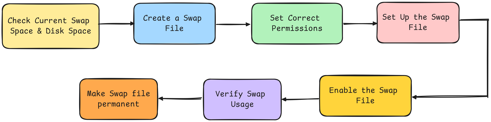

# Swap On Space 💿

## What is Swap Space?
Swap space in Ubuntu  is a portion of the **hard drive** used as **virtual memory** when the **RAM** is full. 
- **Virtual Memory:** Swap acts as an overflow area for RAM. When the system runs out of physical memory (RAM) it moves inactive pages from RAM to the swap space allowing more applications to run.
- **Performance:** Although using swap can help prevent crashes when RAM is full **accessing data from swap is slower than from RAM**. Therefore, it’s best to have enough RAM for our applications.

## Adding swap space on Ubuntu 24.04
<div align="center">
  
</div>

### Step 1 : Check Current Swap Space
To see the current swap usage use
```bash
    sudo swapon --show
```
### Step 2 : Create a Swap File 
Create a 4GB swap file. We can adjust the size as needed.
```bash
    sudo fallocate -l 4G /swapfile
```
### Step 3 : Set Correct Permissions
Secure the swap file with the following command
```bash
    sudo chmod 600 /swapfile
```
### Step 4 : Set Up the Swap File
Format the file to use as swap.
```bash
    sudo mkswap /swapfile
```
### Step 5 : Enable the Swap File
Activate the swap file for immediate use.
```bash
    sudo swapon /swapfile
```
### Step 6 : Verify Swap Usage
Check again to see the new swap file listed.
```bash
    sudo swapon --show
```
### Step 7 : Make Swap File Permanent
To ensure the swap file is activated at boot add it to **`/etc/fstab`**
```bash
    echo '/swapfile none swap sw 0 0' | sudo tee -a /etc/fstab
```
to the **`/etc/fstab`** file we are telling the system:
- **`/swapfile`**: This is the path to the swap file we created.
- **`none`**: This means that there is no specific mount point for swap files.
- **`swap`**: This indicates that the entry is for swap space.
- **`sw`**: This option tells the system to activate the swap space at boot.
- **`0 0`**: These are options for backup, filesystem checks & they can be set to **0** for swap files.
- **`|`**: The pipe **`(|)`** takes the output of the command on its left (**`echo '/swapfile none swap sw 0 0'`**) and passes it as input to the command on its right (**`sudo tee -a /etc/fstab`**).
- **`tee`**: This command reads from standard input and writes to standard output and files. In this case it writes to **`/etc/fstab`**.
- **`-a`**: The **`-a`** option stands for **"append"** It tells tee to add the output to the end of the specified file rather than overwriting it.
- **`/etc/fstab`**: This is the file we want to modify. It contains information about filesystems and swap space that should be mounted or activated at boot.

Adding the **swap file** to **`/etc/fstab`** ensures that the system knows to **activate** the swap file every time it **boots up**. Without this step the swap space **would be lost after a reboot** potentially causing issues if the system runs low on memory. This configuration helps maintain consistent performance and prevents application crashes due to insufficient memory.