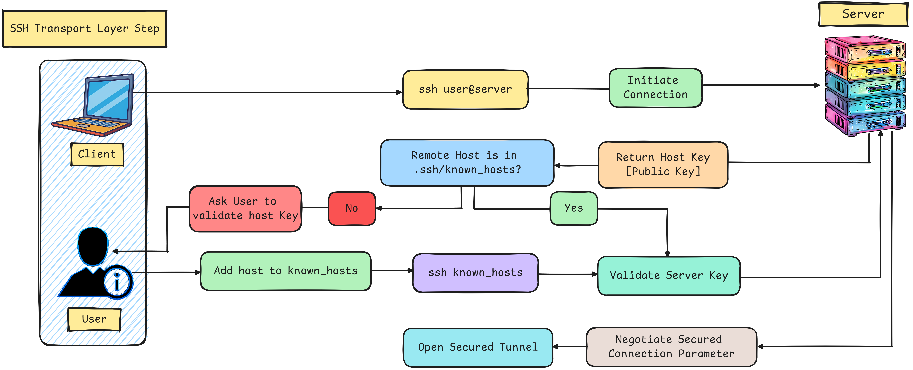

# SSH (Secure Shell) on a Linux-to-Linux system🔐
## What is SSH?
**SSH** or **Secure Shell** is a network protocol that allows secure communication between two computers. It is commonly used for accessing and managing servers remotely.

## SSH Architecture
SSH (Secure Shell) uses **public-key cryptography** to authenticate the remote system and the user trying to connect. It operates on three layers:

  - **Transport Layer:** Handles server authentication, confidentiality & integrity. It also manages port 22 which is the default port for SSH.
  - **User Authentication Layer:** Confirms if the user is recognized by the server and verifies the credentials using various authentication algorithms.
  - **Connection Layer:** Creates an encrypted communication tunnel and splits it into multiple logical channels for different interactions.

These layers work together to securely establish an SSH connection.

Here is a first diagram explaining the summarized steps made during the SSH connection initialization.
<div align="center">
  
</div>

The **client and the server** **validate their mutual keys** and **open a secured tunnel to proceed**.

Here is the detailed steps :
  - The client initiates a **TCP connection** to the **SSH server** on **port 22** (default reserved port).
  - The server responds to the client’s connection and they establish a **TCP handshake**.
  - The server sends its **identification string** to the client with various informations (protocol version, etc).
  - The client sends its own **identification informations** to the server using the same format.
  - Once the identification strings have been exchanged, the **server sends its public key to the client**.
  - If the server is not in the **`“known_hosts”`** file of the client it will **prompt the user if they can trust it or not**. If **yes**, **the server will be added into the list**.
  - If **not**, **this question will prompted everytime**.
  - The **client generates a random session key** and **encrypt it with the server’s public key**.
  - The **server decrypts the session key** using its **private key**.
  - The connection between the **client and the server** is now secured by encrypting each data using the session key.
  
In short, the client and server exchange keys and secure the connection for safe communication.

Here is a second diagram explaining authentication steps.
<div align="center">
  
</div>

Here is the detailed steps :

  - The client sends its **authentication information** to the server. Example here : its **public key**.
  - The server verifies is the **public key** is in the **“authorized_keys”** according to a deductive pattern.
  - If the client’s public key is not authorized, the server rejects it and notify the client.
  - The client tries to **authenticate using the username and password**.
  - The server validates the provided credentials.
  - The client and servers can now exchange data and commands in a secured encrypted way.

[Reference](https://zedas.fr/posts/linux-explained-8-ssh/)

## Configuration of SSH
### Workflow 
<div align="center">
  
</div>

### Step 1. Install SSH on Server
The **`openssh-server`** package is need to be installed to enable **SSH** access to the server.
```bash
    sudo apt update
```
```bash
    sudo apt install openssh-server
```
### Step 2. Start & Enable SSH Service on Server
After installation the SSH service is started & enabled to run at boot.
```bash
    sudo systemctl status ssh
```
```bash
    sudo systemctl enable --now ssh
```
Verify that the service is running successfully & enable service.

### Step 3. Configure custom SSH on Server
The default **SSH port 22** is changed for security reasons & other settings are adjusted to improve security such as disabling empty passwords root login & password-based authentication.

#### 1. Take backup of SSH Configuration File
Before modifying the SSH configuration it is a best practice to **back up the original configuration file** to **avoid accidental misconfiguration**.
```bash
    sudo cp /etc/ssh/sshd_config /etc/ssh/sshd_config_backup
```
#### 2. Open the SSH Configuration File from the Server
Edit the SSH configuration file using a text editor.
```bash
    sudo vim /etc/ssh/sshd_config
```
#### 3. Security Settings for SSH Configuration
1. **Disable Empty Paswword**
By setting **`PermitEmptyPasswords no`** we ensure that no user with an **empty password** can log in via SSH. This prevents unauthorized access from accounts with no password.
```bash
    PermitEmptyPasswords no
```
2. **Change Default SSH Port**
The default **SSH port is 22**. Changing it to a custom port can reduce the number of **brute-force attacks** targeting port 22.
```bash
    port 1646
```
3. **Disable Root Login**
Disabling **root login** via SSH prevents direct **root access** & forces users to log in with a **regular user account** & then use **`sudo`** for **administrative tasks**.
```bash
    PermitRootLogin no
```
4. **Set Idle Timeout** 
The **`ClientAliveInterval`** option defines the idle timeout interval in seconds. Here setting it to **300 seconds (5 minutes)** will **log out** **inactive users** after this time period.
```bash
    ClientAliveInterval 300
```
5. **Disable SSH Protocol 1**
SSH has **two versions 1 and 2**. **Version 1 is outdated and less secure**. Disabling it by **setting Protocol 2** ensures only the **more secure protocol is used.**
```bash
    Protocol 2
```
6. **Allow Selected Users**
We can restrict SSH access to specific users by using the **`AllowUsers directive`**. Replace **User_name01** and **User_name02** with the actual usernames we want to allow SSH access.
```bash
    AllowUsers User_name01 User_name02
```
7. **Disable Password-Based Login**
To enhance security further especially if we are using SSH keys for authentication we can disable password-based logins.
```bash
    PasswordAuthentication no
```
### Step 4. Allow SSH Through the Firewall
The **UFW (Uncomplicated Firewall)** is configured to allow **incoming connections** on the **custom SSH port**.
```bash
    sudo ufw allow from any to any port 2222 proto tcp
```
### Step 5. Reload the Systemd Daemon
This ensures that systemd picks up any changes made to service files (like SSH configuration changes).
```bash
    sudo systemctl daemon-reload
```
### Step 6. Restart SSH Service and Check the Status
After making changes restart the SSH service to apply the changes.
```bash
    sudo systemctl restart ssh
```
To check the status
```bash
    sudo systemctl status ssh
```
### Step 7. Find the IP address of Server machine
```bash
    ip addr
```
### Step 8. Connecting to the Server from Local Machine
Once SSH is configured we can connect to the server using the **`ssh`** command from another **Linux machine (Local)**.
#### 1. Check if SSH Client is Installed on Local Machine
Most Linux systems come with the SSH client pre-installed. However if it is not installed we can do so using the following command.
```bash
    sudo apt install openssh-client
```
#### 2. Connect to the Server
Once we have the IP address use the following command to connect to the server. Replace username with the actual username of the server & IPaddress with the server's IP.
```bash
    ssh username@IPaddress
```
#### 3. Connect to a Custom SSH Port
If SSH is configured to use a **custom port** (not the default port 22) specify the port using the **`-p`** option.
```bash
    ssh username@IPaddress -p portnumber
```
### Step 9. Start and Stop at boot
In Ubuntu 24.04 (and newer) managing services like **SSH** is done using **`systemctl`** which is part of **systemd** the system and service manager. Here's a breakdown of how to **enable**, **disable** or **check the status** of the SSH service using **`systemctl`**
#### 1. Enable SSH at Boot
To ensure SSH starts automatically every time the system boots, use the following command. This sets SSH to start on boot.
```bash
    sudo systemctl enable ssh
```
#### 2. Disable SSH at Boot
To prevent SSH from starting automatically at boot use this command. We might use this if we don’t want the SSH service running after every reboot.
```bash
    sudo systemctl disable ssh
```
### Step 10. Set Up SSH Key-Based Authentication (Recommended)
#### 1. Generate SSH Key Pair on the Client Machine
On the client machine (Linux system from which we want to initiate the SSH connection):
```bash
    ssh-keygen -t rsa -b 4096 -C "your_email@example.com"
```
- **`-t rsa`**: Specifies the type of key to create (RSA is widely used).
- **`-b 4096`**: Specifies the key size (4096 bits is a good balance of security).

**Note :** The **`-C`** flag in the **ssh-keygen** command is used to add a comment to our SSH key for **identification purposes**. While many people use their **email address** as a **recognizable identifier** we can put anything we like instead of **your_email@example.com**. It doesn't have to be a Gmail address or even an email address at all.
- Prompted for a file location. We can press Enter to accept the default (**`~/.ssh/id_rsa`**).
- Optionally, we can provide a passphrase for an additional layer of security. Otherwise, press Enter for no passphrase.
#### 2. Copy the Public Key to the Server
We now copy the generated **public key** (**`id_rsa.pub`**) to the **remote machine**. This can be done using the **`ssh-copy-id`** command:
```bash
    ssh-copy-id username@remote_host
```
- Replace **`username`** with the server machine's username.
- Replace **`remote_host`*** with the IP address or domain of the server machine.

The command will copy the public key to the server machine’s **`/.ssh/authorized_keys`** file setting the proper permissions.

#### 3. SSH Into the Remote Machine Without a Password
Now that the key is set up, we can **SSH** into the **remote machine** without being prompted for a password
```bash
    ssh username@remote_host
```
#### 4. Verify Permissions
Ensure that permissions on the remote machine are set correctly for SSH to accept the key
```bash
    chmod 700 /.ssh
```
```bash
    chmod 600 /.ssh/authorized_keys
```
#### 5. Disable Password Authentication (Optional)
To enhance security, we can disable **password-based authentication** so only **key-based authentication** is allowed. Edit the SSH configuration file on the server machine:
```bash
    sudo vim /etc/ssh/sshd_config
```
Find and set the following parameters :
```bash
    PasswordAuthentication no
    PubkeyAuthentication yes
```
Then restart the SSH service
```bash
    sudo systemctl restart ssh
```
Now the connection can only be made using **key-based authentication**.
### Step 11 : Verify and Troubleshoot on Server
#### 1. To test the connection
```bash 
    ssh username@ip_address -p 222
```
#### 2. If we encounter issues, ensure the following:
- The firewall on Ubuntu allows the custom port.
- The SSH service is running and configured properly.

## Necessary Commands
Displays the contents of the **`authorized_keys`** file of the **Servers** which contains **public keys authorized** to access the system via **SSH**.
```bash
    cat /.ssh/authorized_keys
```
Displays the contents of the **public key file** located on the **local machine**, which can be shared with servers to enable SSH key-based authentication.
```bash
    cat /.ssh/id_rsa.pub
```
## Why We Use the SSH Config File?
The SSH **config file** helps **simplify** & **automate** our **SSH connections** by letting us save settings for multiple servers in one place. Instead of typing the server's **IP**, **port**, **username** & **key file** every time we connect, we can **store these details** in the **config file** & use a simple alias to connect easily.

### Steps to Set Up an SSH Config File in Ubuntu (Local Machine)

#### 1. Navigate to the `.ssh` Directory
The **`.ssh`** directory is where **SSH keys** & **config files** are stored. If we are not already there, we can move to the **`.ssh`** directory using:
```bash
    cd /.ssh
```
If the **`.ssh`** directory doesn’t exist we can create it.

#### 2. Edit the `config` File
We can edit the **`SSH config file`** using a text editor like **vim**
```bash
    vim /.ssh/config
```
#### 3. Add Host Configuration
In the config file, we add a block for each server we want to connect to.
```bash 
    Host Server_Name
        HostName IP_Address_of_Server
        User User_Name
        Port Port_Number
        IdentityFile ~/.ssh/key
```
  - **`Host`** : This is a label or alias we give to a specific SSH connection. We can use this alias later to connect to the server easily without typing the full details. Replace **`Server_name`** with actual Server Name.
  - **`HostName`** : The server’s **IP address** or **Domain Name**.
  - **`User`** :  The username we use for connecting.
  - **`Port`** : This indicates the port number on which the SSH service is running. 
  - **`IdentityFile`** : This specifies the **path** to the **private SSH key file** used for **authentication**. The SSH client will use this key when connecting to the server.

Each line in the **SSH config file** defines specific parameters for connecting to a server, simplifying the SSH command by allowing us to use an alias instead of entering the full connection details each time.

#### 4. Save the File
Press **`Esc`** to exit **Insert Mode** & Type **`:wq`** then press **Enter**.
#### 5. Set Correct Permissions
The config file should be readable only by the owner. We can ensure the correct permissions with:
```bash
    chmod 600 /.ssh/config
```
#### 6. Connect to the Server
Now, we can connect to the server using the alias we defined in the config file
```bash
    ssh Server_Name
```
This will automatically use the settings we defined for the alias web-server (IP, port, user, and key file).

#### 7. Repeat for Additional Servers
We can add more server configurations in the same config file, just like the example above.