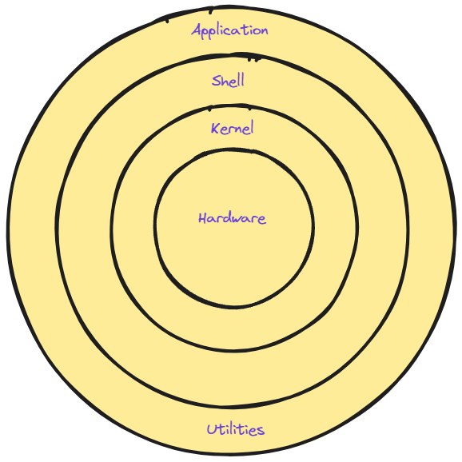

# 💻Linux Concepts & Basic Commands💻


Welcome to **Linux Concepts & Basic Commands** This repository is your guide to mastering essential Linux commands and understanding core concepts. Whether you're new to Linux or looking for a reliable reference, this guide will help you navigate the Linux operating system with confidence.

# Table of Contents

1. [Introduction](#introduction)
    1. [What is Linux?](#what-is-linux)
    2. [Who is Linux?](#who-is-linux)
    3. [Where is Linux?](#where-is-linux)
    4. [Why is Linux?](#why-is-linux)
    5. [Linux Architecture](#linux-architecture)
    6. [File System Hierarchy in Linux](#file-system-hierarchy-in-linux)
    7. [Linux Distributions](#linux-distributions)
    5. 


# Introduction 

## What is Linux?
Linux is an **open-source operating system** based on **Unix**, widely used for *servers*, *desktops*, and *embedded systems*. 
It provides a stable, secure, and flexible environment for managing hardware resources and running applications.

## Who is Linux?
Linux was created by **Linus Torvalds** in **1991**. It started as a personal project and has grown into a major force in computing, supported by a global community of developers.

## Where is Linux?
**World Wide Web :**
- 67% of the world’s web-servers run Linux (2016)
**Research/High-Performance Compute :**
- Google, Amazon, NSA, 100% of TOP500  Super-computers.
**Modern Smartphones and devices :**
- The Android phone
- Amazon Kindle
- Smart TVs/Devices

## Why is Linux?
- Free and open-source.
- Powerful for research datacenters
- Personal for desktops and phones
- Universal
- Community (and business) driven.

## Linux Architecture

The architecture of Linux is the underlying structured layer like other operating systems. Generally, it has four fundamental layers. Those are: **application**, **shell**, **kernel**, and **hardware**.



### Hardware

Linux interacts with various essential hardware components:

**CPU :** Executes instructions; Linux supports diverse CPU architectures for portability.

**RAM :** Primary memory used for storing data and programs; Linux kernel manages memory allocation.

**Input/Output Devices :** Supported via device drivers, facilitating interaction between hardware and the kernel.
    
- Input Devices : Include keyboards, touchpads, and others for user interaction.
- Output Devices : Such as monitors and printers, displaying information to users.

### Kernel
The kernel is the core of the operating system, managing hardware and providing a foundation for software. It performs crucial functions:

**Device Management :** Handles device drivers, input/output operations, and peripheral devices.

**Resource Management :** Manages CPU processes and bridges resources with processes.

**Memory Management :** Allocates and manages system memory efficiently.

**System Calls :** Handles requests for file operations, memory control, and process management.

**Performance Optimization :** Balances resources, schedules tasks, and enhances system efficiency.

Linux's compatibility with different hardware configurations ensures versatile usage across a wide range of devices.

### Types of Kernels in OS Architecture
Monolithic; Microkernel; Hybrid; Nano kernel & Exo kernel

Linux includes a **monolithic kernel** which makes this OS the most stable and fast.

### Command Line Shell
The command line Interface is the user interface where the user types commands in a text form. When the user provides the command in the terminal, the shell interprets the commands for the kernel. The shell also has some built-in commands that help the user to navigate, manage, and change the file system.

### Applications
Applications are the programs that the user runs on top of the architecture. The applications are the user space element that includes database applications, media players, web browsers, and presentations.

### System Utilities and Libraries
The system utilities and libraries provide a wide range of functions to manage the system. Low-level hardware complexity to high-level user support is served by the system utilities and libraries.

# File System Hierarchy in Linux

The file system hierarchy in Linux organizes the structure of directories and files, ensuring efficient management and accessibility:


This hierarchical structure ensures consistency and provides a standardized way to organize and access files and directories in Linux systems.

```Root Directory (/):```  The top-level directory containing all other directories and files in the system.

```/bin:``` Essential user binaries (executable programs) required for system boot and maintenance.

```/boot:``` Files required for the boot process, including the Linux kernel and bootloader configurations.

```/dev:``` Device files representing hardware devices connected to the system, managed by the kernel.

```/etc:``` System-wide configuration files used by various applications and services.

```/home:``` User home directories where personal files and configurations are stored.

```/lib and /lib64```: Libraries essential for programs and shared libraries (on 64-bit systems).

```/media:``` Mount points for removable media devices such as USB drives and optical discs.

```/mnt:``` Temporary mount points for filesystems mounted manually by the user.

```/opt:``` Optional software applications installed manually by the system administrator.

```/proc:``` Virtual file system providing information about processes and system resources.

```/root:``` Home directory for the root user (superuser) account.

```/sbin:``` System binaries (executable programs) used for system administration tasks.

```/srv:``` Data files for services provided by the system.

```/tmp:``` Temporary files accessible to all users, typically cleared on system reboot.

```/usr:``` Secondary hierarchy containing read-only user data and programs (user utilities).

```/var:``` Variable data files, including logs, spool files, and temporary files that may change during system operation.


## Linux Distributions

A Linux distribution (distro) is a packaged version of Linux that includes the kernel, system utilities, applications, and a package manager.

**Ubuntu :** Known for its ease of use and community support, ideal for beginners and desktop users.

**Fedora :** Focuses on innovation, providing the latest features and technologies.

**Debian :** Renowned for its stability and vast repository of software packages.

**CentOS :** A free, community-supported alternative to Red Hat Enterprise Linux, commonly used for servers.

**Arch Linux :** A rolling release system aimed at advanced users who prefer custom installations.

**openSUSE :** Offers robust tools for developers and system administrators, available in Leap and Tumbleweed versions.

**Mint :** Based on Ubuntu, designed to be user-friendly with a focus on multimedia support.

Each distribution caters to different user needs, from general desktop use to specialized server environments.


```bash
   
```
```bash
   
```
```bash
   
```
```bash
   
```
```bash
   
```
```bash
   
```
```bash
   
```
```bash
   
```
```bash
   
```
```bash
   
```

