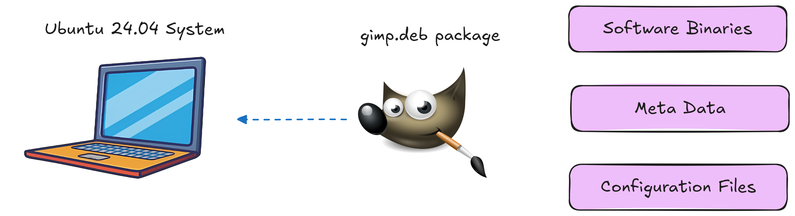

# 💻Linux Theoretical Concepts💻


Welcome! to **Linux Theoretical Concepts** guide. This is your go-to guide for mastering Linux concepts and theory. Whether you're a beginner or need a quick reference, it offers essential insights to enhance your Linux understanding and usage.

## Table of Contents

1. [What is Linux?](#what-is-linux)
2. [Who is Linux?](#who-is-linux)
3. [Where is Linux?](#where-is-linux)
4. [Why is Linux?](#why-is-linux)
5. [Common Challenges](#common-challenges)
5. [Linux Architecture](#linux-architecture)
6. [File System Hierarchy in Linux](#file-system-hierarchy-in-linux)
7. [Linux Distributions](#linux-distributions)
8. [Linux VS Unix](#linux-vs-unix)
9. [Linux Interaction](#Linux-interaction)

## What is Linux?
Linux is an **open-source operating system** based on **Unix**, widely used for *servers*, *desktops*, and *embedded systems*. 
It provides a stable, secure, and flexible environment for managing hardware resources and running applications.

## Who is Linux?
Linux was created by **Linus Torvalds** in **1991**. It started as a personal project and has grown into a major force in computing, supported by a global community of developers.

## Where is Linux?
**World Wide Web :**
- 96
3% of the top 1 milions world’s web-servers running on Linux.
**Research/High-Performance Compute :**
- Google, Amazon, NSA, 100% of TOP500  Super-computers.
**Modern Smartphones and devices :**
- The Android phone (86% of all smartphones are powered by Linux)
- Amazon Kindle
- Smart TVs/Devices

## Why is Linux?
- Free and open-source.
- Powerful for research datacenters
- Personal for desktops and phones
- Universal
- Community (and business) driven.

## Common Challenges
- **Directory Navigation :** Difficulty navigating directory structures and files.
- **Text Editors :** Lack of experience with text editors, especially Vi or Vim.
- **Linux Variants :** Confusion over different flavors of Linux.
- **Installation Errors :** Issues during application and dependency installation.
- **Package Managers :** Unfamiliarity with rpm, dpkg, apt, and yum.
- **Networking Issues :** Problems with networking between VMs.
- **Permissions :** Challenges with permissions and security settings.
- **Hands-On Practice :** Insufficient practical experience.

## Working with Shell - I
A shell is a **command-line interface** that allows users to interact with the operating system by typing commands to perform tasks.
Using a **shell** instead of a **Graphical User Interface** (GUI) allows for greater efficiency, automation through scripting, and more precise control over system tasks especially for advanced users and server management.
### Home Directory
The home directory is a unique, user-specific folder (e.g., `/home/username`) where personal files, settings, and configurations are stored in a Linux system.


### Commands & Arguments 
In Linux, **`commands`** are instructions given to the shell to perform specific tasks and **`arguments`** are additional pieces of information passed to those commands to modify their behavior or specify what they operate on.
- **Structure :**
    - **Command :** The main instruction (e.g., **`ls, cp, mkdir`**).
    - **Argumants :** Options or parameters that provide context or modify the command's behavior (e.g., **`-l`*for long format).
- **Example :**

    
   
   Here **`/home/user`** an argument that specifying the directory to list.
- **Options :** Usually start with **`-`** or **`--`**(e.g., **`-a`**, **`--all`**).

### Commands Type 
In Linux, commands can be categorized into 2 types based on their location on the system.
- **External Commands :** In Linux, **external commands** refer to commands that are not built into the shell itself but are separate executable programs stored in the file system. These commands are usually located in directories such as **`/bin`**, **`/usr/bin`**, **`/sbin`**, and **`/usr/sbin`**, and they are run by the shell when called from the terminal. **Example :** **`ls`**, **`cp`**, **`grep`**

- **Internal Commands :** These are built into the shell itself and do not require external programs to run.  **Example :** **`cd`**, **`echo`**, **`pwd`**

### Linux Basic Commands

For more details on commands see the [Linux Commands](https://github.com/PritamChakrabortyShuvo/Linux/blob/main/Linux-Commands.md) file.

### Absoluiute & Relative Path

A **path** is the location of a file or directory in the filesystem which can be either **absolute** (full path) or **relative** (relative to the current directory).
- **Absolute Path :** An absolute path is the full path to a file or directory from the root directory **`/`**.Starting from the top of the filesystem. For example: **`/home/user/directory/file.txt`**.

- **Relative Path :** A relative path is the path to a file or directory from our current working directory, without starting from the root. For example, if we are in **`/home/user`** the relative path to **`file.txt`** inside directory would be **`directory/file.txt`**.


### Pushd and Popd
**`pushd`** & **`popd`** are commands in Bash used for managing the directory stack allowing us to easily switch between directories.

- **`pushd` :** This command saves the current directory on a stack and then changes to the specified directory. For example, running **`pushd`** **`/path/to/directory`** will add the current directory to the stack and navigate to **`/path/to/directory`**.

- **`popd` :** This command removes the top directory from the stack and changes to that directory. For instance, running **`popd`** after a **`pushd`** will take you back to the directory that was saved on the stack.

These commands are useful for quickly navigating between multiple directories without needing to remember or retype paths.
### Shell Types
There are various shell types in linux. They are 
- **Bourne Shell (`sh`) :** The original Unix shell, known for its simplicity and scripting capabilities, widely used for system scripts.
- **C Shell (`csh/tcsh`) :** A shell with C-like syntax, offering features like aliases and job control, with **`tcsh`** as an enhanced version.
- **Korn Shell (`ksh`) :** A superset of the Bourne shell, adding features like command-line editing and improved scripting.
- **Z Shell (`zsh`) :** A highly customizable shell with advanced features like auto-completion, globbing, and theming.
- **Bourne Again Shell (`bash`) :** A popular, feature-rich shell, backward-compatible with **`sh`**, and widely used as the **default shell in Linux systems**.

**`bash`** shell has some features like
- Bash Auto Completion
- Alias
- Command History

### Bash Environment Variables
Bash environment variables are like placeholders that store important information such as **user settings** or **system paths**. They help the shell and programs run smoothly and can be used to control how commands work. For example :


Logname show the name which stored in the logname.

We can also set an environment variable. For example :


### PATH Variables
The **PATH** variable in Bash is a list of directories where the shell searches for executable programs when we enter a command. If a command is in one of these directories we can run it without needing to type the full path.

### Bash Prompt
The **bash prompt** is the text displayed in the terminal where we type commands. It typically shows our username, hostname, and current director & can be customized using environment variables like **`$PS1`**.


### Linux Prompt

**The Linux prompt**, also known as the **command prompt**, is the interface in a terminal where users type commands. It typically looks like this :

<div style="text-align: center;">
    
</div>

**Components of the Linux Prompt**

- **`username:`** The current user's name.

- **`hostname:`** The name of the computer.

- **`current-directory:`** The directory the user is currently in.

- **`$ or #:`** The symbol at the end of the prompt. **`$`** **indicates a regular user**, while **`#`** **indicates the root (superuser)**.

The prompt waits for the user to enter commands, which are then executed by the shell.


## Core Concepts
Linux core concepts include the system's main parts, like the kernel, file system, processes, and user management, which work together to run applications smoothly and securely.

### Linux Kernel
The **kernel** is the core part of the Linux operating system that manages hardware resources, facilitates communication between software and hardware & handles system processes, memory, and file management. 
It acts as a bridge between applications and the underlying hardware.


**Kernel functions** are the core tasks performed by the Linux kernel to manage system resources and ensure smooth operation. Here’s a brief overview of the main kernel functions

- **Device Management :** Handles device drivers, input/output operations, and peripheral devices.

- **Resource Management :** Manages CPU processes and bridges resources with processes.

- **Memory Management :** Allocates and manages system memory efficiently.

- **System Calls :** Handles requests for file operations, memory control, and process management.

- **Performance Optimization :** Balances resources, schedules tasks, and enhances system efficiency.

Linux's compatibility with different hardware configurations ensures versatile usage across a wide range of devices.

- **Types of Kernels in OS Architecture :** Monolithic; Microkernel; Hybrid; Nano kernel & Exo kernel

Linux includes a **monolithic kernel** which makes this OS the most stable and fast.

**Kernel Space and User Space :**

**Kernel Space** and **User Space** are two distinct areas of memory in a Linux operating system that separate kernel-level operations from user-level processes.


**Key Differences :**

- **Control :** Kernel space has full control over the system, while user space operates under constraints set by the kernel.
- **Stability :** Crashes or errors in user space applications do not affect the kernel, enhancing system stability.

This separation is crucial for system security, stability, and efficiency, preventing user applications from directly interfering with critical system operations.


### Linux Boot Sequence
The **Linux boot sequence** is the series of steps that the system goes through to start up and load the operating system. Here’s a simple explanation of each point in the sequence:

1. **BIOS POST**

    - **Explanation :** When we power on our computer the **BIOS (Basic Input/Output System)** performs a **POST (Power-On Self-Test)** to check the hardware components like the CPU, RAM, and storage devices.
    - **Purpose :** This step checks that all important hardware like RAM, hard drives, and keyboard is working properly before starting the computer. **Example :** When we turn on the computer, we might see a brief screen with a logo indicating that the system is checking if everything is okay. If any hardware issues are detected an error message may appear, preventing the system from booting.

2. **Boot Loader (GRUB2)**

    - **Explanation :** After the **POST** is successful, the **BIOS** loads the boot loader, such as **GRUB2 (Grand Unified Bootloader)** from the bootable disk.
    - **Purpose :** **GRUB2** shows a list of installed operating systems and lets us choose which one to start. After we make a selection, it loads the operating system's kernel into memory to begin booting. **Example :** When the computer starts, GRUB2 might show options like "Ubuntu" and "Windows." We can select "Ubuntu" and it will load the necessary files to start the operating system.

3. **Kernel Initialization**

    - **Explanation :** The boot loader loads the Linux kernel into memory and hands over control to it. The kernel initializes the system hardware, sets up memory management, and starts managing processes.
    - **Purpose :** This step sets up the operating system by detecting and configuring hardware, like loading drivers for devices such as keyboards and mouse.  **Example :** When we turn on the computer and the operating system starts the kernel initializes drivers for our keyboard and mouse so that they can be used within the OS.

4. **INIT Process (Systemd)**

    - **Explanation :** After the kernel has initialized the system, it starts the **INIT** process, which is often managed by **Systemd** in modern Linux distributions. This process is the first user-space application that runs.
    - **Purpose :** The **INIT** process is the first program that runs after the kernel is ready; it starts other programs and services that the system needs to work, like logging in and connecting to the internet. **Example :** When our system boots up, INIT starts the login screen so we can enter our username and password.


### Systemd Targets
**Systemd** is a system and service manager for Linux that starts up the system, manages services, and improves boot speed by running processes in parallel.

**Runlevels :** Runlevels are different modes that tell a Linux system what services to start or stop, helping to control how the system operates at startup or during use
- **`3` :** Boots into a **`Command Line Interface`**
- **`5` :** Boots into a **`Graphical Interface`**

### File System Hierarchy in Linux

The file system hierarchy in Linux organizes the structure of directories and files, ensuring efficient management and accessibility.

- The structure resembles an upside-down tree
- Directories (a.k.a. folders) are collections of files and other directories.
- Every directory has a parent except for the root **`("/")`** directory.
- Many directories have subdirectories.


This hierarchical structure ensures consistency and provides a standardized way to organize and access files and directories in Linux systems.

**`Root Directory (/):`**  The top-level directory containing all other directories and files in the system.

**`/bin:`** Essential user binaries such as **`cp`**, **`mv`**, **`mkdir`** etc. are located here.

**`/boot:`** Files required for the boot process, including the Linux kernel and bootloader configurations.

**`/dev:`** Device files representing hardware devices such as hdd, mouse, keyboard etc. connected to the system, managed by the kernel.

**`/etc:`** Store most of the configuration files used by various applications and services.

**`/home:`** User home directories where personal files and configurations are stored.

**`/lib and /lib64:`** Libraries essential for programs and shared libraries (on 64-bit systems).

**`/media:`** Mount points for removable media devices such as USB drives and optical discs.

**`/mnt:`** Temporary mount points for filesystems mounted manually by the user.

**`/opt:`** 3rd party software applications installed manually by the system administrator.

**`/proc:`** Virtual file system providing information about processes and system resources.

**`/root:`** Home directory for the root user (superuser) account.

**`/sbin:`** System binaries (executable programs) used for system administration tasks.

**`/srv:`** Data files for services provided by the system.

**`/tmp:`** Stores temporary data.

**`/usr:`** Secondary hierarchy containing read-only user data and programs (user utilities).

**`/var:`** Variable data files, including logs, spool files, and temporary files that may change during system operation.

### Linux Distributions

A Linux distribution (distro) is a packaged version of Linux that includes the kernel, system utilities, applications, and a package manager.

- **Ubuntu :** Known for its ease of use and community support, ideal for beginners and desktop users.

- **Fedora :** Focuses on innovation, providing the latest features and technologies.

- **Debian :** Renowned for its stability and vast repository of software packages.

- **CentOS :** A free, community-supported alternative to Red Hat Enterprise Linux, commonly used for servers.

- **Red Hat Enterprise Linux (RHEL):** A commercial distribution designed for enterprise use known for its support, security and stability.

- **Mint :** Based on Ubuntu, designed to be user-friendly with a focus on multimedia support.

Each distribution caters to different user needs, from general desktop use to specialized server environments.

## Package Management 

**Package management** refers to the process of installing, upgrading, configuring and removing software packages in an operating system. It involves using package managers which are tools that automate these tasks by managing dependencies, ensuring that the correct versions of software are installed and handling software repositories.

### Software Package 
**A software package** is a bundled collection of files including executables, libraries and metadata that are grouped together for easy installation and management on an operating system.



The image illustrates the components involved in installing GIMP on an Ubuntu 24.04 system. A .deb package containing the GIMP software binaries, metadata and configuration files is downloaded and installed on the system making GIMP accessible for use.

### Package Manager 
**A package manager** is a tool that automates the installation, updating and removal of software packages on an operating system such as **`DPKG`**, **`APT`**, **`APT-GET`**, **`RPM`**, **`YUM`** & **`DNF`**. 


Here’s a simple explanation of each package managers 
1. **`DPKG`**
    - **Type:** Package Manager
    - **Description:** A low-level tool for managing **`.deb`** packages on Debian-based systems. It installs, removes and queries packages directly but does not handle dependencies automatically.
2. **`APT`**
    - **Type:** Package Manager
    - **Description:** A higher-level package manager for Debian-based systems that simplifies software management by **automatically resolving dependencies** and allowing easy installation and updating of packages from repositories.
3. **`APT-GET`**
    - **Type:** Command-Line Tool (part of APT)
    - **Description:** A command-line tool used with APT for installing, upgrading, or removing packages. It provides a more granular control over package management compared to the simpler apt command.
4. **`RPM`**
    - **Type:** Package Manager
    - **Description:** A package manager for Red Hat-based systems that manages .rpm packages directly. It requires **manual handling of dependencies** or the use of additional tools for dependency resolution.
5. **`YUM`**
    - **Type:** Package Manager
    - **Description:** A higher-level package manager for Red Hat-based systems that simplifies the management of RPM packages automatically handling dependencies and allowing users to easily install and update software.
6. **`DNF`**
    - **Type:** Package Manager
    - **Description:** The next-generation package manager that replaces YUM in Red Hat-based systems. It offers better performance and improved dependency resolution while maintaining similar functionality.

    

All of these are package managers or tools used to manage software packages but **`DPKG`**, **`APT`** and **`APT-GET`** are primarily for **Debian-based systems** while **`RPM`**, **`YUM`** and **`DNF`** are for **Red Hat-based systems**.

Package managers perform several key functions to simplify software management on a system:

- **Installation of Software:** Automatically downloads and installs software packages, ensuring all required dependencies are met.
- **Updating Software:** Helps keep installed software up to date by fetching and applying the latest updates from repositories.
- **Uninstallation:** Safely removes software and any unused dependencies without affecting other installed packages.
- **Dependency Resolution:** Automatically identifies and installs any required software that a package depends on to function properly.
- **Repository Management:** Provides access to software repositories where packages are stored, making it easy to find, install, and update software.
- **Package Querying:** Allows checking of installed software, version details, and other metadata.

These functions make managing software on Linux systems efficient and straightforward.

### Upgrade vs Update 
In the context of package management, update and upgrade have different meanings:

- **Update:** This refreshes the package list on the system by retrieving the latest information about available software versions from the repositories. It doesn't install or modify any packages, just ensures the system is aware of the newest versions. **Example:** **`sudo apt update`**

- **Upgrade:** This installs the latest available versions of the installed software packages based on the updated package list. It updates the actual software on the system. **Example:** **`sudo apt upgrade`**

### APT vs APT-GET
**`APT`** and **`APT-GET`** are both command-line tools used for managing packages on Debian-based systems like Ubuntu but they have some differences:
- **`APT`:** A more user-friendly command introduced in newer versions of Ubuntu, combining features of various older **`APT`** tools (like **`apt-get`**, **`apt-cache`**). It provides a simpler syntax and improved output for most common package management tasks. **Example:** **`sudo apt update`**; **`sudo apt install package_name`**

- **`APT-GET`:** An older, more feature-rich command-line tool that has been around for a long time. It provides more granular control over package management but is less streamlined for everyday use. **Example:** **`sudo apt-get update`**; **`sudo apt-get install package_name`**

In summary, **`APT`** is a modern,more convenient version for most users while **`APT-GET`** is still used for more advanced or specific tasks.

## Working with Shell - II

File editors are tools used to create, modify, and manage text files in Linux. Common file editors include:

- **`nano`**: A simple, easy-to-use text editor with basic features. Ideal for beginners.

- **`vi / vim`**: A powerful, advanced text editor with extensive features for efficient text editing. Suitable for experienced users.But **`vi`** is widely used and **`vim`** is a enhanced version of **`vi`**. 

- **`gedit`**: A graphical text editor with a user-friendly interface, part of the GNOME desktop environment.

These editors help users edit configuration files, write scripts, and manage documents directly from the command line or a graphical interface.

### Vim Editor 
**`vim`** (Vi IMproved) is a highly configurable and powerful text editor used in Linux. It extends the capabilities of the older **`vi`** editor and is suitable for both beginners and advanced users.
```bash
    vim file_name
```


#### ESC Mode
In vim (Vi IMproved) editor, the **`ESC`** (Escape) key is pivotal for navigating and executing commands in Normal mode. Here are key functionalities in ESC mode:

- **Navigation:**

    - **`h`**: Move left
    - **`j`**: Move down
    - **`k`**: Move up
    - **`l`**: Move right

- **Editing:**

    - **`x`**: Delete the character under the cursor
    - **`dd`**: Delete the current line
    - **`yy`**: Yank (copy) the current line
    - **`p`**: Paste the yanked text after the cursor position

- **Search and Replace:**

    - **`/pattern`**: Search forward for "pattern"
    - **`n`**: Move to the next occurrence of the search pattern
    - **`N`**: Move to the previous occurrence of the search pattern
    - **`:s/pattern/replacement`**: Replace "pattern" with "replacement" in the current line

- **Saving and Quitting:**

    - **`:w`**: Save changes (write)
    - **`:q`**: Quit (close the file)
    - **`:q!`**: Quit without saving changes (force quit)
    - **`:wq`** or **`:x`**: Save changes and quit

- Modes:

    - Normal Mode: Press **`Esc`** to enter Normal mode, where you can navigate and execute commands.
    - Insert Mode: Press **`i`** to enter Insert mode, where you can insert and edit text.
    - Visual Mode: Press **`v`** to enter Visual mode, where you can select blocks of text for editing or copying.

## Linux Networking Basic
Linux networking is fundamental for system administration especially in managing servers configuring network interfaces & ensuring smooth communication between devices. Some components are described below.

### Name Resolution
**Name resolution** is like translating a website name into an address that computers understand called an IP address like **`142.250.182.206`**. Just like a GPS needs an address to take us somewhere our computer needs the IP address of a website to load it.

#### How Does Name Resolution Work?
When we type a website’s name like **`www.example.com`** in our browser:
1. **Our Computer Looks for answer locally :**
    - It checks if it already knows the IP address for that website this is called a **"cache"**.
    - It checks a special file called the **hosts file** under **`/etc/host`** which has some website names and their IP addresses listed manually.
2. **If it doesn’t find the IP address**
    - It asks a **`DNS server`** to find the IP address for the website.
3. DNS server finds the IP address and sends it back to our computer.
4. Our computer connects to the website using the IP address it got & the page loads.
#### Why Do We Need Name Resolution?
1. Instead of remembering IP addresses we only need to remember names like **`google.com`**.
2. Just like we need an address to find a house computers need an IP address to find a website.

### DNS (Domain Name System)
**DNS (Domain Name System)** is like the "phone book" of the internet. It translates human-friendly domain names like **`www.example.com`** into IP addresses like **`192.168.1.1`** that computers use to communicate with each other. Without DNS we'd need to remember the IP addresses of every website we visit which would be very difficult.

#### How DNS Works?
Let’s say we want to visit **`www.example.com`**. Here’s what happens step-by-step:
1. **We Type a Website Name**
    - We open our browser and type **`www.example.com`**.
2. **Our Computer Checks its Memory**
    - First, our computer checks if it has recently visited **`www.example.com`** & already knows its IP address.
    - If it finds the IP address in its memory (cache) it will use it immediately to connect to the website. If not it moves to the next step.
3. **Our Computer Asks a DNS Server**
    - If our computer doesn’t know the IP address it asks a DNS server (like asking a librarian for help finding a book).
    - The DNS server checks if it has the IP address for **`www.example.com`**.
4. **DNS Server Asks for Help**
    - If the DNS server doesn’t have the IP address, it asks a bigger server called the **Root Server** for help.
    - The **Root Server** doesn’t know the IP address either but it knows which server can help us get closer to the answer.
5. **Finding the Right Server**
    - The Root Server sends our DNS server to a **TLD (Top Level Domain)** server. This server handles **`.com`**, **`.org`** etc.
    - The TLD Server then directs us to the **Authoritative Name Server** which knows the exact IP address for **`www.example.com`**.
6. **Getting the IP Address**
    - The **Authoritative Name Server** gives the IP address say **`192.168.1.100`** for **`www.example.com`**.
7. **DNS Server Sends the IP Address Back to Us**
    - The DNS server now sends the IP address to our computer.
8. **Our Computer Connects to the Website**
    - With the IP address our computer can now connect to **`www.example.com`** & the website appears in our browser.

 Here is the workflow diagram of this complete process :


Simple Workflow diagram :


### Domain Name
A domain name is the human-readable address we use to access websites on the internet. Instead of remembering IP addresses we use easy to remember names like **`www.google.com`**.
#### Structure of a Domain Name
A domain name typically has two main parts:

1. **Second-Level Domain (SLD):** This is the main name that identifies the website. For example, in **`www.google.com`**, **"google"** is the SLD.

2. **Top-Level Domain (TLD):** This follows the SLD and indicates the type or location of the website. Common examples include:
    - **.com:** Commercial websites
    - **org:** Organizations (usually non-profits)
    - **.net:** Network-related websites
    - **.edu:** Educational institutions
    - **.gov:** Government websites
    - **Country-specific TLDs:** Like .uk for the United Kingdom, .ca for Canada, .bd for Bangladesh.

Putting it together **`www.google.com`** consists of:
- **`www`:** A subdomain often used to indicate the web version of the site.
- **`google`:** The second-level domain.
- **`.com`:** The top-level domain.


#### How Domain Names Work?
1. **Registration:** To get a domain name, we need to register it through a domain registrar like **GoDaddy**, **Namecheap**, etc. This usually involves paying a yearly fee.

2. **DNS Linking**: Once registered the domain name needs to be linked to an IP address through the **Domain Name System**. This tells the internet where to find the website associated with that name.

3. **Accessing the Website:** When we type a domain name in our browser:
    - Our computer uses DNS to find the corresponding IP address.
    - It connects to the server at that IP address and loads the website.

### Hub
A hub is a device that allows multiple devices to connect to a network and communicate with each other but doesn’t manage traffic.
#### How Does a Hub Work?
1. **Data Transmission:** When one device sends data to the hub the hub broadcasts that data to all other connected devices.
2. **No Intelligence:** A hub does not filter or direct data. It simply sends everything it receives to all ports regardless of the destination.
3. **Physical Layer:** Hubs operate at the physical layer (Layer 1) of the OSI model, meaning they deal with the physical connection and transmission of data.
#### Characteristics of Hubs
1. **Broadcasting:** Sends data to all devices on the network, leading to potential data collisions if multiple devices send data simultaneously.
2. **Limited Intelligence:** Hubs don’t learn device addresses; they do not store any information about connected devices.
3. **Simple Setup:** Hubs are easy to set up, as they typically only require connecting devices via Ethernet cables.
#### Limitations of Hubs
1.	If the HUB is failed the entire network is failed
2.	We can’t send private data through HUB
3.	HUB doesn’t provide any security
4.	It doesn’t support full-duplex transmission

### Switching 
Switching is how we connect devices like computers and printers in a local network so they can share information.
### How Does Switching Work?
1. **Data Packets:** Information is sent in small pieces called packets.
2. **Network Switch:** A network switch is a device that helps send these packets to the right place, kind of like a post office.
3. **Address Book:** Each device has a unique address called a MAC address. The switch keeps a list of these addresses to know where to send data.
4. **Learning:** When a packet arrives the switch checks who sent it and adds that address to its list.
5. **Forwarding:** If the switch knows where to send the packet it goes straight to that device. If it doesn't know it sends the packet to everyone to find the right device.
#### Benefits of Switching
1. **Faster Communication:** Switches help devices talk to each other quickly by sending data only to the intended device.
2. **Less Confusion:** Data goes to the right device not to everyone on the network.
3. **Easy to Expand:** We can easily add more devices by connecting them to the switch.

## Linux VS Unix
Unix generally refers to a family of proprietary operating systems, while Linux is an open-source variant developed by Linus Torvalds. It is often considered a Unix-like system due to its compatibility with Unix standards and APIs

**Origins:**
    
- `Unix:` Created in the 1970s by AT&T Bell Labs.
- `Linux:` Created by Linus Torvalds in 1991 as an open-source alternative.
    
**Licensing:**
   
- `Unix:` Proprietary and often commercial.
- `Linux:` Open-source and free under the GNU General Public License (GPL).

**Portability:**

- `Unix:` Limited to specific hardware.
- `Linux:` Highly portable, runs on a wide range of devices from desktops to servers to smartphones.

**Community:**

- `Unix:` Developed by specific companies with less community involvement.
- `Linux:` Supported by a large global community of developers and users.

**Usage:**

- `Unix:` Used in enterprise servers and critical systems.
- `Linux:` Used in servers, desktops, cloud computing, mobile devices, and embedded systems.

**Cost:**

- `Unix:` Usually requires a paid license.
- `Linux:` Generally free, with optional paid support available.

**Flexibility**

- `Unix:` Less flexible due to proprietary nature.
- `Linux:` Highly customizable with many different distributions to choose from.

## Linux Interaction
Linux interaction refers to the methods by which users communicate with and control the Linux operating system, primarily through **shells** and **prompt**.
